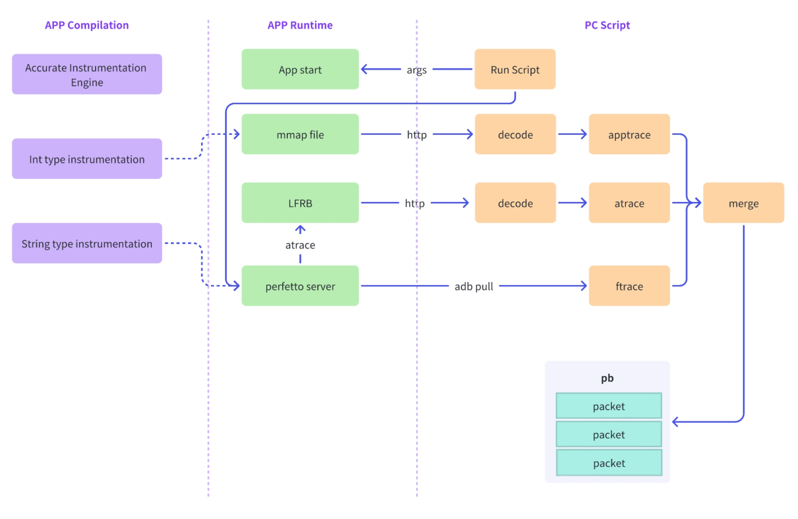
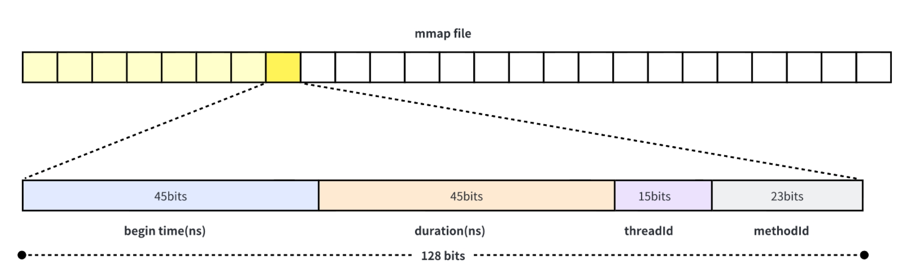

[重磅升级，btrace 2.0 技术原理大揭秘](INTRODUCTION.zh-CN.MD)

# Backgrounds

Over a year ago, we formally open-sourced btrace (AKA RheaTrace), a high-performance trace tool based on Systrace. And now ByteDance has up to 20 apps using btrace for daily performance optimization work. During this year, we received a lot of feedback from the community and within the company. It's all about user experience, performance experience, and monitoring data.

-   **User experience:** PC script depends on Systrace and Python 2.7 environment, which makes the environment setup very complicated. The SDK also relies on external storage read/write permissions, which makes it difficult to use. The trace file is large in size and takes a long time to open.
-   **Performance experience:** When the number of methods in application reaches millions, our performance loss is close to 100%, which poses a significant challenge for performance optimization work.
-   **Monitoring data:** The trace is lacking sufficient information, making it difficult to analyze the causes of some time-consuming methods. For example, it currently only includes synchronized lock information and lacks information on other locks such as ReentrantLock. In addition, the rendering monitoring only includes default system information and lacks business logic information.

As the Android system evolves, Google gradually abandoned the Systrace tool and began promoting the Perfetto tool. At the same time, Android began to restrict sdcard read/write permissions, which caused compatibility issues for btrace on higher versions of the Android system.

Therefore, we have decided to revamp btrace to solve the most frequently and intensively reported issues by users, adapt to new features released by Google, and fix existing compatibility issues. The key improvements of btrace 2.0 are as follows:

-   **User Experience:** Migrating the PC script from Python to Java, removing the SDK's requirement for sdcard read/write permission, and changing the Trace file format to the PB protocol, reducing the trace file size by 70%, and improving opening speed by 7 times!
-   **Performance Experience:** Revamping the method Trace collection logic, switching data from strings to integers, reducing memory usage by 80%. Data storage is changed to mmap mode, optimizing lock-free queue logic, providing accurate instrumentation strategies, and further reducing performance loss to 15% under full instrumentation!
-   **Monitoring Data:** Adding 4 new data monitoring capabilities, including detailed data on Rendering, Binder, thread creation, and Wait/Notify/Park/Unpark!

Next, we will introduce their implementation principles to help you gain a deeper understanding of the important upgrades of btrace 2.0.

# Principles

## About Perfetto

Perfetto and Systrace are tools used for performance analysis and debugging in Android, but they differ in some ways:

-   **Systrace:** is a tool in the Android SDK that can be used to capture and analyze timing events of different system processes. It provides a graphical interface for analyzing system performance bottlenecks. The events that Systrace can capture include CPU, memory, network, disk I/O, rendering, etc. The working principle of Systrace is to capture and parse timing events in the kernel and user space, and record them in HTML files. Developers can use the Chrome browser to analyze these events. Systrace can help developers identify system bottlenecks, but its performance is not ideal, especially when dealing with large amounts of data.
-   **Perfetto:** is a new low-overhead trace collection tool designed to optimize the performance of Systrace. The goal of Perfetto is to provide faster and more granular trace collection than Systrace, and support integration with other cross-platform tools. Perfetto records trace data in binary format and uses a protobuf-based data exchange format for data export, which can be integrated with other analysis and visualization tools such as Grafana, SQLite, and BigQuery. Perfetto collects a wide range of data, including CPU usage, network byte streams, touch input, rendering, etc. Compared with Systrace, Perfetto is more excellent in performance and customization.

Therefore, it can be seen that Perfetto is a more advanced and excellent replacement tool for Systrace. It provides more powerful data collection and analysis capabilities, better performance, and better customization, providing developers with more comprehensive and in-depth performance analysis and debugging tools.

## Overall



The entire process is as follows:

-   **App Compilation:** During application compilation, our instrumentation supports two data types: Int and String. Int type is used to record method names, while String type can record parameter values. In addition, we have added an accurate instrument engine that can intelligently identify time-consuming code and perform instrumentation.
-   **App Runtime:** During application runtime, efficient collection of function apptrace information is required. For Int type information, we collect it using mmap lock-free queue. For string type information, we directly write it into atrace using system functions. We also have a proxy atrace writing logic that replaces it with LFRB implementation for high-performance writing.
-   **PC Script:** The PC script is used to control the application's operation and turn on/off the Trace function. The PC script also needs to encode the collected apptrace and atrace data, and merge them with the system's ftrace.

## Detail

### User Experience

The user experience is the most frequently reported issue by users, mainly regarding storage permission, Systrace environment, Python environment, file size, and opening speed. We have completed optimizations to address these user experience issues.

#### 1. Removing Permissions Dependency

The PC script data processing requires access to App data, so storing the data on external SDCard for the script to retrieve via adb pull is the most convenient way. However, Android Q began limiting full external SDCard access. Although requestLegacyExternalStorage can temporarily avoid this problem, it is not a long-term solution.

To solve this problem, we created an HTTP server in the App to expose the data externally. However, script access still needed to determine an IP address. Therefore, we used the adb forward function, so we could use localhost to access the data.

With the above solution, we solved the problem of reading App data. We also faced the problem of App reading script parameters, such as maxAppTraceBufferSize and mainThreadOnly. Through research, we discovered that we could set parameters for the mobile phone through adb setprop within the script. The app reads the parameters through __system_property_get. As long as the parameter property name starts with 'debug.', it will not face any permission issues.

```
// set properties in PC scripts
Adb.call("shell", "setprop", "debug.rhea.startWhenAppLaunch", "1");

// read properties in App
static jboolean JNI_startWhenAppLaunch(JNIEnv *env, jobject thiz) {
    char value[PROP_VALUE_MAX];
    __system_property_get("debug.rhea.startWhenAppLaunch", value);
    return value[0] == '1';
}
```

#### 2. Migrating Script Environment

btrace 1.0 was developed based on Systrace, which had a dependency on Python 2.7. However, Python 2.7 has been officially deprecated, and most Android engineers are not familiar with Python, which can lead to wasting a lot of time solving environment problems. Therefore, we plan to switch from Systrace to Perfetto, which will no longer depend on Python 2.7. We have also rewritten the script in Java, which is a language that Android engineers are more familiar with. Now, users only need to have Java and adb environments available to easily use btrace 2.0.

#### 3. Reducing Output File Size

btrace 1.0 output files were HTML texts based on Systrace, which resulted in large file sizes and slow loading speeds. Perfetto supports the pb protocol, which, due to its structured data storage, can achieve smaller file sizes and faster parsing speeds. Therefore, btrace 2.0 also changed the data format from HTML to pb, significantly reducing the output file size while also greatly improving Trace loading speeds.

We will briefly introduce the Perfetto pb data protocol and then explain how to encode the collected apptrace and atrace into the pb format and merge them with the system's ftrace.

Perfetto pb consists of a series of TracePackets, of which FtraceEventBundle is one type used by btrace. FtraceEventBundle is a mechanism used by Android to collect system Trace data, consisting of a large number of FtraceEvents that can be used to record various system behaviors. btrace mainly uses its PrintFtraceEvent to record method information, as shown in the example below:

```
int threadId = 10011;
FtraceEventBundle.Builder bundle = FtraceEventBundle.newBuilder()
        .addEvent(
                FtraceEvent.newBuilder()
                        .setPid(threadId) // set kernal pid of thread, it's tid
                        .setTimestamp(System.nanoTime())
                        .setPrint(
                                Ftrace.PrintFtraceEvent.newBuilder()
                                        // buf format as B|$pid|$msg\n 
                                        // 10010 is pid. '\n' is required
                                        .setBuf("B|10010|someEvent\n"))) 
        .addEvent(
                FtraceEvent.newBuilder()
                        .setPid(threadId)
                        .setTimestamp(System.nanoTime() + TimeUnit.SECONDS.toNanos(2))
                        .setPrint(
                                Ftrace.PrintFtraceEvent.newBuilder()
                                        .setBuf("E|10010|\n")))
        .setCpu(0);
Trace trace = Trace.newBuilder()
        .addPacket(
                TracePacketOuterClass.TracePacket.newBuilder()
                        .setFtraceEvents(bundle)).build();
try (FileOutputStream out = new FileOutputStream("demo.pb")) {
    trace.writeTo(out);
}
```

The example above will result in the following Trace:


Next, we will introduce how the PC script converts collected apptrace information into pb format. First, the script retrieves the mmap file on the phone via adb http, and then reads its contents as follows:

```
// read the mapping, we have included it in the assets directory of the apk.
Map<Integer, String> mapping = Mapping.get();
// decode and save into result
List<Frame> result = new ArrayList<>();
byte[] bytes = FileUtils.readFileToByteArray(traceFile);
ByteBuffer buffer = ByteBuffer.wrap(bytes).order(ByteOrder.LITTLE_ENDIAN);
while (buffer.hasRemaining()) {
    long a = buffer.getLong();
    long b = buffer.getLong();
    // decode startTime / duration / tid / methodId
    long startTime = a >>> 19;
    long dur0 = a & 0x7FFFF;
    long dur1 = (b >>> 38) & 0x3FFFFFF;
    long dur = (dur0 << 26) + dur1;
    int tid = (int) ((b >>> 23) & 0x7FFF);
    int mid = (int) (b & 0x7FFFFF);
    // record begin Frame and end Frame
    result.add(new Frame(Frame.B, startTime, dur, pid, tid, mid, mapping));
    result.add(new Frame(Frame.E, startTime, dur, pid, tid, mid, mapping));
}
// sort by time
result.sort(Comparator.comparingLong(frame -> frame.time));
```

After that, we use the FtraceEventBundle to encode List<Frame>. We will not go into the details of this here. The processing for atrace is also the same.

Finally, we will introduce how to merge the collected apptrace, atrace, and system ftrace. As previously mentioned, Perfetto pb consists of a series of TracePackets. Therefore, all we need to do is to package the app's Trace into TracePackets separately and then add them to the system's TracePacket collection to complete the Trace merging.

```
Trace.Builder systemTrace = Trace.parseFrom(systraceStream).toBuilder();
FtraceEventBundle.Builder bundle = ...;
for (int i = 0; i < events.size(); i++) {
    bundle.addEvent(events.get(i).toEvent());
}
systemTrace.addPacket(TracePacket.newBuilder().setFtraceEvents(bundle).build());
```

However, there is an assumption here that the apptrace/atrace timestamp is consistent with the system ftrace timestamp. In reality, according to test results, the ftrace timestamp on different devices may have different types, such as BOOTTIME or MONOTONIC TIME. This means that the app can only be compatible with some devices, regardless of which timestamp it uses. To solve this problem, we first record an initial BOOTTIME and MONOTONIC TIME when we start recording trace information. Then, when we record timestamps, we use MONOTONIC time consistently. Finally, when the PC script parses the ftrace timestamp, it determines whether to use MONOTONIC or BOOTTIME. If it is closer to MONOTONIC, we use MONOTONIC. Otherwise, we use BOOTTIME. We did not record BOOTTIME for each function, but we can convert it from MONOTONIC to the two types of timestamps' initial time difference.

```
if (Math.abs(systemFtraceTime - monotonicTime) < Math.abs(systemFtraceTime - bootTime)) {
    Log.d("System is monotonic time.");
} else {
    long diff = bootTime - monotonicTime;
    Log.d("System is BootTime. time diff is " + diff);
    for (Event e: events) {
        e.time += diff;
    }
}
```

### Performance Optimizaion

#### 1. Trace Data Structure Optimization

btrace 1.0's instrumentation was dependent on the Systrace mode, which inserted Trace.beginSection and endSection at method entry and exit. However, the beginSection/endSection parameters were strings. This caused a memory occupancy of millions of strings for millions of methods, which put enormous pressure on memory. In addition, string data can only be recorded using locks or LFRB, which makes it difficult to achieve efficient and concurrent data writing. We can only store the data in a buffer, which can lead to data loss if the buffer is too small. If it is too large, it will waste memory.

btrace 2.0's instrumentation supports int types, which means that method execution can be recorded in a mmap file. We use atomic operations to calculate the storage location each time, achieving a lock-free concurrent write, while int types occupy less memory, resulting in smaller intermediate file sizes.

Furthermore, we found that the thread ID and method ID were redundantly recorded at both method entry and exit. This also causes memory waste. Therefore, we optimized the recording to only store one record of start time, method consumption time, thread ID, and method ID at method exit, occupying only 2 longs, which can fully utilize memory.

Instrumentation logic can refer to the pseudocode:

```
// in application
public void appLogic() {
    long begin = nativeTraceBegin();
    // buz logic
    nativeTraceEnd(begin, 10010);
}

// sdk tracing logic
long nativeTraceBegin() {
    return nanoTime();
}

void nativeTraceEnd(long begin, int mid) {
    long dur = nanoTime() - begin;
    int tid = gettid();
    write(begin, dur, tid, mid);
}
```

Example of data recording format:



Java method instrumentation can only insert Java code, but mmap data collection requires C/C++ implementation. This requires the use of JNI calls, each of which requires a thread state switch and may involve GC lock operations. High-frequency JNI calls can have significant performance overhead.

The system also contains a large number of high-frequency JNI calls, but to solve this performance problem, it has been optimized to avoid thread state switching through the use of the @CriticalNative and @FastNative annotations. The @FastNative can improve the performance of native methods up to 2 times, while the @CriticalNative can improve it up to 4 times.

We hope to use the system's optimization and add the @CriticalNative annotation to methods to speed up method calls. However, the @CriticalNative annotation is a hidden API that we cannot use directly. Therefore, we created a jar package that contains the CriticalNative annotation and depended on it in the project using the compileOnly method to achieve the purpose of using the @CriticalNative annotation. The annotation definition is copied from the system source code:

```
// ref: https://cs.android.com/android/platform/superproject/+/master:libcore/dalvik/src/main/java/dalvik/annotation/optimization/CriticalNative.java;l=26?q=criticalnative&sq=
@Retention(RetentionPolicy.CLASS)  // Save memory, don't instantiate as an object at runtime.
@Target(ElementType.METHOD)
public @interface CriticalNative {}
```

Following is a usage example:

```
// Java JNI methods，must be static，no synchronized，parameters must be primatives
@CriticalNative
public static long nativeTraceBegin();

// Critical JNI method，no JNIEnv* and jclass
static jlong Binary_nativeTraceBegin() {
    ...
}

// register native dynamically
JNINativeMethod t = {"nativeTraceBegin", "(I)J",  (void *) JNI_CriticalTraceBegin};
env->RegisterNatives(clazz, &t, 1);
```

@CriticalNative/@FastNative is a feature supported only on Android 8.0 and later. For devices before 8.0, we can use the '!' sign in the method signature to enable FastNative:

```
// Fast JNI, JNIEnv * and jclass is required
static jlong Binary_nativeTraceBegin(JNIEnv *, jclass) {
    ...
}

// register jni methods 
JNINativeMethod t = {"nativeTraceBegin", "!(I)J",  (void *) Binary_nativeTraceBegin};
env->RegisterNatives(clazz, &t, 1);
```

The optimization solution for int type data collection has been fully introduced. The data decoding process has already been explained in the previous text, so we will not elaborate on it here.

#### 2. Accurate Instrumentation Engine

Another important performance optimization is the instrumentation strategy optimization. As the number of methods in an application increases, the number of instrumented methods also increases, and over time, this will result in greater performance loss for the application.

In version 2.0, we hope to establish an intelligent rule set that can accurately identify time-consuming methods and only instrument time-consuming code. Therefore, we carried out an analysis.

Although the ART supports over 200 bytecode instructions, the instructions that may cause performance bottlenecks are often fewer, such as IO reading, synchronized bytecode, reflection, Gson parsing, and other function calls. During the compilation process, we treat methods that call these related instructions as suspected time-consuming methods, and we do not instrument the remaining non-time-consuming functions because they do not cause performance problems, thereby greatly reducing the instrumentation scope.

The following are some examples of time-consuming instructions:

| TYPES                     | INSTRUCTIONS                                                                | NOTES                                                                                                                                                                                                                                       |
|---------------------------|-----------------------------------------------------------------------------|---------------------------------------------------------------------------------------------------------------------------------------------------------------------------------------------------------------------------------------------|
| Lock                      | monitorenter & monitorexit ；ACC_SYNCHRONIZED                                | Java lock keywords (e.g. synchronized, ReentrantLock, etc.)                                                                                                                                                                                 |
| Native methods            | ACC_NATIVE                                                                  | Due to the lack of byte code analysis for Native methods, we consider that they all may have potential performance issues.                                                                                                                  |
| Loops                     | goto                                                                        | would be added to the "potential performance issues" list based on the specific situation.                                                                                                                                                  |
| Special Method Invocation | InvokeVirtual； InvokeSpecial； InvokeStatic； InvokeInterface； InvokeDynamic； | Here, we classify special method calls, most of which are from Android SDK: 1. IO related, file operations, so loading, dex loading, font loading, etc. 2. UI related, View layout, drawing, animation, etc. 3. IPC related, IPC interface. |
| Large Methods             | InvokeVirtual； InvokeSpecial； InvokeStatic； InvokeInterface； InvokeDynamic； | If the number of byte code instructions called directly or indirectly in a method exceeds the threshold, it can be considered a CPU-intensive method that may have potential performance issues.                                            |

Based on the above time-consuming instructions, we designed an accurate instrumentation engine that allows users to choose the instrumentation methods they need based on their specific situations. The supported configuration options are shown below:

```
# Instrument lock-related methods
-tracesynchronize

# Instrument Native method call
-tracenative

# Instrument Aidl methods
-traceaidl

# Instrument methods that contain loops
-traceloop

# Disable instrumentation for time-consuming methods
-disabledefaultpreciseinstrumentation

# Enable instrumentation for large methods with over 40 invocations
-tracelargemethod 40

# Instrument the caller of configured method
-traceclassmethods rhea.sample.android.app.PreciseInstrumentationTest {
   test
}

# Instrument methods annotated with this
-tracemethodannotation org.greenrobot.eventbus.Subscribe

# Instrument all methods in this class
-traceclass io.reactivex.internal.observers.LambdaObserver

# Preserve the parameter values of this method in Trace
-allowclassmethodswithparametervalues rhea.sample.android.app.RheaApplication {
   printApplicationName(*java.lang.String);
}
```

After accurate instrumentation, the number of app instrumentations reduced by 94%, resulting in significant performance improvements while preserving relatively complete trace data.

In summary, by weighing the advantages and disadvantages of instrumenting time-consuming functions, we can obtain enough information on time-consuming functions while avoiding unnecessary performance losses caused by excessive instrumentation.

### New monitoring data

Monitoring data is at the core of Trace and determines whether Trace can bring practical value to users. In addition to method execution tracing, version 2.0 also brings four new capabilities: rendering monitoring, Binder monitoring, blocking monitoring, and thread creation monitoring. The following will introduce the relevant background and implementation principles.

#### 1. Rendering Monitoring

The Android system provides tracing points for RenderThread's crucial execution logic, but the information provided is not comprehensive enough to intuitively analyze the business code that specifically impacts rendering issues. The following picture is an example of a RenderThread trace captured by Atrace:


To address this limitation, we have further expanded and refined this information by adding support for tracking critical View nodes related to rendering. The following picture shows the results of our optimizations:


The implementation principle as below:


1. So basically what this does is that it helps you get the layout information of a View when you inflate it using a special LayoutInflater. Then, it binds it to the native RenderNode by linking it to the View's RenderNode so that you can trace the layout information in the RenderNode's name field.
2. To make things simple, what you do is you hook up the important parts of the rendering process - RenderNode::prepareTreeImpl in SyncFrameState and RenderNodeDrawable::forceDraw in RenderPipeline. This lets you record the layout information of the View in the Trace, so you can keep track of it easily.

#### 2. Binder Monitoring

The Binder information in the original atrace only includes information on binder transactions, lacking specific binder interface and names, which limits the effectiveness of problem diagnosis. For example, in the following image, we can not determine the specific Binder call:


The goal of btrace's Binder enhancement is to parse and display the interface and names of Binder calls, achieving the following result:


The core principle is to use plt hook to record the code of the binder call and the interfaceName in the Parcel& data parameter by IPCThreadState::transact.

```
status_t IPCThreadState::transact(int32_t handle, uint32_t code, const Parcel& data,
                                  Parcel* reply, uint32_t flags);
```

However, the Parcel structure is not public, making it difficult to parse the interfaceName information from data. Therefore, we use hooking to record the interfaceName and Parcel association information through Parcel::writeInterfaceToken, and then obtain the interfaceName through querying in IPCThreadState::transact.

```
status_t Parcel::writeInterfaceToken(const char* interface) {
    // pairing this Parcel and interface
}

status_t IPCThreadState::transact(int32_t handle, uint32_t code, const Parcel& data,
                                  Parcel* reply, uint32_t flags) {
    // query interface by Parcel& data
    // trace into file
    RHEA_ATRACE("binder transact[%s:%d]", name.c_str(), code);
}
```

This records the following information, including the interfaceName and code:

```
binder transact[android.content.pm.IPackageManager:5]
```

In addition, it is necessary to parse the code to the corresponding Binder call method. In AIDL, the interfaceName$Stub class's static field records each code and the corresponding Binder call name. At the end of capturing the trace, the mapping between code and name can be obtained through reflection and saved to outputs.

```
#android.os.IHintManager
TRANSACTION_createHintSession:1
TRANSACTION_getHintSessionPreferredRate:2
#miui.security.ISecurityManager
TRANSACTION_activityResume:27
TRANSACTION_addAccessControlPass:6
```

Finally, replace the code in the Trace recorded at runtime with the real name through PC scripts.

#### 3. Blocking Monitoring

The system atrace provides information on system lock conflicts, such as through the following figure, which shows that the main thread Keva encounters a lock conflict with thread 28722 when acquiring a lock. This provides important information for optimizing thread blocking.


However, thread blocking reasons are not limited to lock conflicts but also include thread waiting caused by wait/park, etc. The btrace blocking monitoring provides this part of the blocking information. The following is an example of wait/notify association. By checking the lock obj ID, we can determine the code of the notify that matches the current thread wait:


The principles of wait and park waiting are similar. Here, we use the more familiar wait/notify combination as an example to explain.

wait/notify are both methods directly defined by Object and are JNI methods that can be recorded by hooking JNI calls.

```
public final native void wait(long timeoutMillis, int nanos) throws InterruptedException;
public final native void notify();
```

In the proxy method, the identityHashCode of the lock object is recorded, so that wait/notify can be associated using this identityHashCode.

```
static void Object_waitJI(JNIEnv *env, jobject java_this, jlong ms, jint ns) {
    ATRACE_FORMAT("Object#wait(obj:0x%x, timeout:%d)", Object_identityHashCodeNative(env, nullptr, java_this), ms);
    Origin_waitJI(env, java_this, ms, ns);
}

static void Object_notify(JNIEnv *env, jobject java_this) {
    ATRACE_FORMAT("Object#notify(obj:0x%x)", Object_identityHashCodeNative(env, nullptr, java_this));
    Origin_notify(env, java_this);
}
```

#### 4. Thread Creation Monitoring

When analyzing Trace, we may encounter some abnormal threads, and we often need to analyze where the threads are created. However, this part of information is lacking in traditional Trace.

Therefore, btrace adds thread creation monitoring data, and the core principle is to proxy pthread_create, recording the thread creation and the tid of the created thread. However, the created thread ID can not be obtained from pthread_create result. Through analyzing the system source code, we find that pthread_t is essentially a pointer to pthread_internal_t, and pthread_internal_t records the ID of the created thread.

```
// https://cs.android.com/android/platform/superproject/+/master:bionic/libc/bionic/pthread_internal.h
struct pthread_internal_t {
    struct pthread_internal_t *next;
    struct pthread_internal_t *prev;
    pid_t tid;
};

int pthread_create_proxy(pthread_t *thread, const pthread_attr_t *attr,
                         void *(*start_routine)(void *), void *arg) {
    BYTEHOOK_STACK_SCOPE();
    int ret = BYTEHOOK_CALL_PREV(pthread_create_proxy,
                                 thread, attr, start_routine, arg);
    if (ret == 0) {
        ATRACE_FORMAT("pthread_create tid=%lu", ((pthread_internal_t *) *thread)->tid);
    }
    return ret;
}
```

The result is shown in the figure below. For example, if we find that the usage of Thread 16077 is very low, we should locate its creation code and replace it with a thread pool to improve performance.


By searching for pthread_create tid=16077, the corresponding creation stack can be found.


# Summary and Outlook

We have now introduced the main optimization of btrace 2.0, and further optimizations need to be experienced in daily use. We welcome you to refer to [btrace 2.0 Integration and Usage Guide](README.MD) for integration or upgrade. 2.0 is not the end point but the starting point of a new journey. We will continue to optimize btrace to the extreme in the following:

1.  **User experience:** Deeply optimize the user experience, such as supporting trace collection of indeterminate time and optimizing collection speed.
1.  **Performance experience:** Continuously explore performance optimization, combining front-facing and side-facing optimization to provide more extreme performance experience.
1.  **Monitoring data:** Based on Java and ART virtual machines, build a more comprehensive monitoring capability, including memory, C/C++, JavaScript, and more.
1.  **Usage scenarios:** Provide online scenario usage plans to help solve offline performance problems.
1.  **Ecological construction:** Build a comprehensive ecosystem around btrace 2.0, automatically discovering inventory and incremental performance problems through performance diagnosis and performance anti-deterioration.

Finally, welcome everyone to discuss and exchange ideas at any time, and work together to build the ultimate btrace tool!