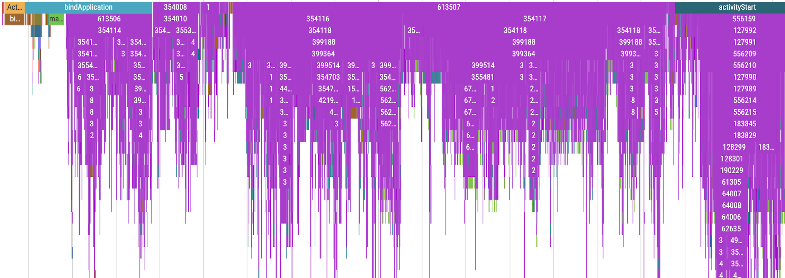
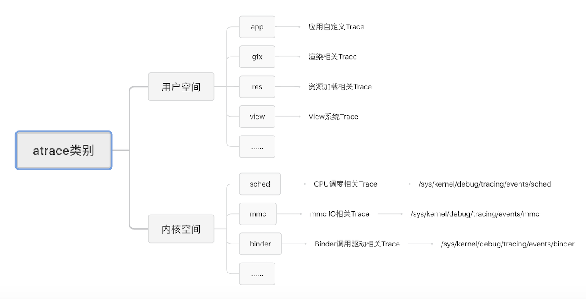
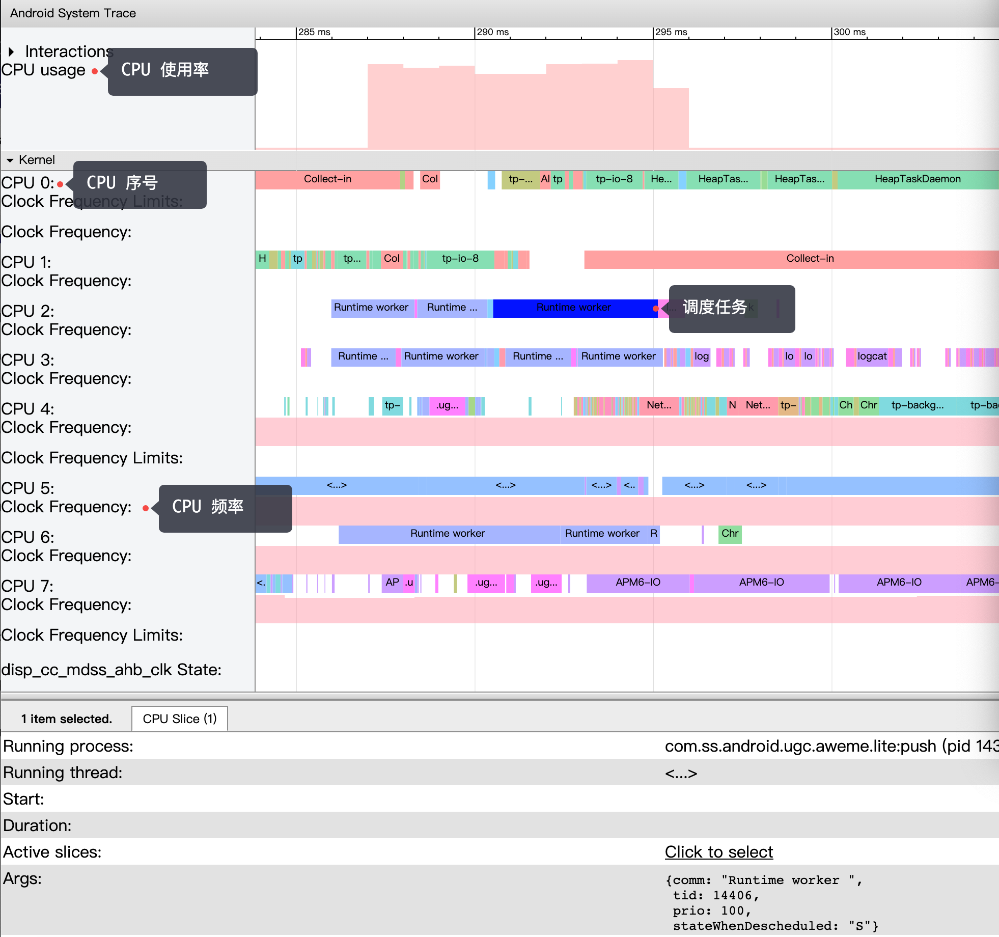
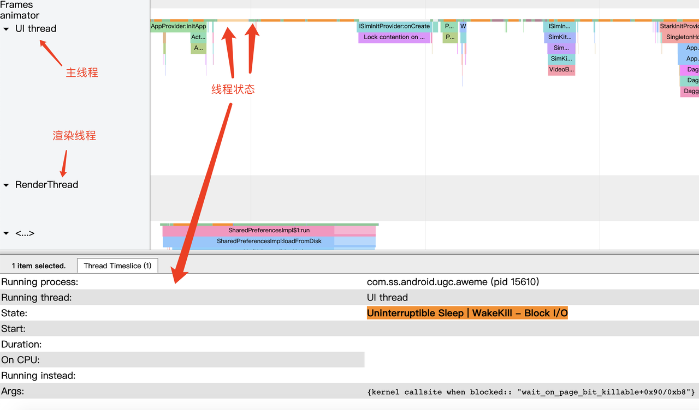
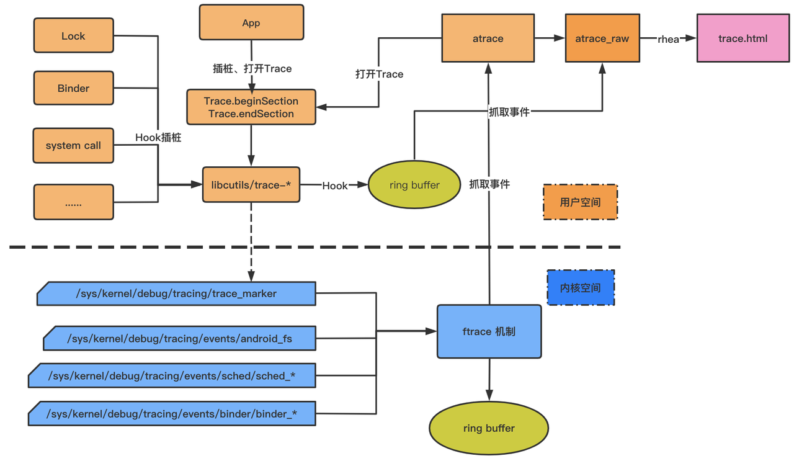
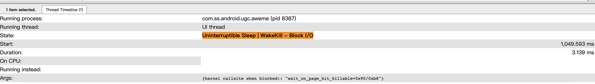
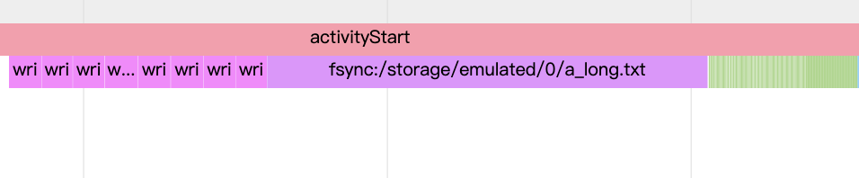
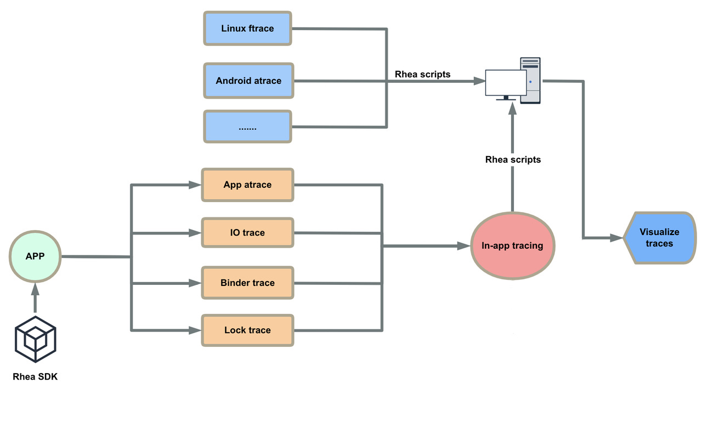

## 介绍

btrace（又名 RheaTrace）是抖音基础技术团队自研的一款高性能 Trace 工具，它基于 Systrace 实现，并针对 Systrace 不足之处加以改进，核心改进点如下。

1. 效率提升：编译期间为 App 方法自动注入[自定义事件](https://developer.android.com/topic/performance/tracing/custom-events?hl=zh-cn)，并提供高效、灵活配置规则。
2. 性能提升：改进 Systrace 文件实时写 [atrace](https://perfetto.dev/docs/data-sources/atrace) 数据方式，性能提升最大 400 % 以上。
3. 实用性提升：额外提供更详细 IO 数据，大幅提升方法耗时归因效率；使用独创方案彻底来解决方法因执行异常引起 trace 数据不闭合问题。

目前字节跳动已有多款 App 接入，包括抖音、TikTok、今日头条、幸福里等均已接入 RheaTrace，并为其体验优化提供强有力支持。借助 RheaTrace 将为您的 App 带来极致流畅体验，RheaTrace 使用效果如下（因保密原则，每个方法用 ID 表示）。



## Systrace 概述

### 简介

如果我们使用过 Systrace 分析应用性能，我们都知道 Systrace 提供 Category 配置让用户决定采集哪些系统 atrace 数据，如下命令，从 sched 开始后续是不同类别的 atrace 数据。

```
python systrace.py -o mynewtrace.html sched freq idle am wm gfx view \
    binder_driver hal dalvik camera input res
```

atrace 的数据类型见下图。



其中，用户空间 atrace 类型包括应用层自定义 Trace 事件、系统层 gfx 渲染相关 Trace、系统层锁相关 Trace 信息等，其最终都是通过调用Android SDK 提供 `Trace.beginSection` 或者 `ATRACE_BEGIN` 记录到同一个文件 `/sys/kernel/debug/tracing/trace_marker` 中。此节点允许用户层写入数据，`ftrace` 会记录该写入操作时间戳。当用户层发生函数调用时，`ftrace` 可以记录被跟踪函数的运行时间。atrace 若需记录用户层某一 trace 类型，只需激活对应 TAG 类型即可。如选择 `gfx`，则会激活 `ATRACE\_TAG\_GRAPHICS`，并将渲染事件记录到 `trace_marker` 文件中。

内核空间的数据主要是一些补充分析数据，如 freq、sched、binder 等，常用 CPU 调度相关信息包括。

1. CPU 频率变化情况。
2. 任务执行情况。
3. 大小核调度情况。
4. CPU Boost 调度情况。



关于图中一些标签释义。

1. CPU 使用率：右边柱状图越高，表明使用率越高。
2. CPU 序号：标识 CPU 核心序号，表示该设备有 8 个核心，编号 0 -7。
3. CPU 频率：右边对应的粉色柱状图表示其频率变化趋势。
4. 调度任务：标识在该 CPU 核心上正在运行的任务，点击任务可查看其 ID、优先级等信息。

这些信息 App 可以直接读取 `/sys/devices/system/cpu` 节点下相关信息获得，而另外一部分标识线程状态信息则只能通过系统或者 adb 才能获取，且这些信息不是统一节点控制，需要激活各自对应的事件节点，让 ftrace 记录下不同事件的 tracepoint。内核在运行时，根据节点的使能状态，会往 ftrace 缓冲中记录事件。

例如，激活线程调度状态信息记录，需要激活类似如下相关节点。

```
events/sched/sched_switch/enable
events/sched/sched_wakeup/enable
```

激活后，则可以获取到线程调度状态相关的信息，比如。

1. Running: 线程在正常执行代码逻辑。
2. Runnable: 可执行状态，等待调度，如果长时间调度不到，说明 CPU 繁忙。
3. Sleeping: 休眠，一般是在等待事件驱动。
4. Uninterruptible Sleep: 不可中断的休眠，需要看 Args 描述来确定当时状态。
5. Uninterruptible Sleep - Block I/O: IO 阻塞。



最终，上述两大类事件记录都汇集到内核态同一缓冲中， Systrace 工具是通过指定抓取 trace 类别等参数，然后触发手机端 `/system/bin/atrace` 开启对应文件节点信息，接着 atrace 会读取 ftrace缓存，生成只包含 ftrace 信息的 atrace_raw 信息，最终通过脚本转换成可视化HTML文件，大致流程如下。



### 源码分析

Systrace 提供 `Trace#beginSection(String)` 和 `Trace.endSection()` 采集 atrace 数据，首先，我们大致了解下 atrace 工作原理，以 `android.os.Trace#beginSection` 作为分析入口。

```
public static void beginSection(@NonNull String sectionName) {
    if (isTagEnabled(TRACE_TAG_APP)) {
        if (sectionName.length() > MAX_SECTION_NAME_LEN) {
            throw new IllegalArgumentException("sectionName is too long");
        }
        nativeTraceBegin(TRACE_TAG_APP, sectionName);
    }
}
```
`android.os.Trace#beginSection` 会调用 `nativeTraceBegin` 方法，该方法实现参考 [frameworks/base/core/jni/android\_os\_Trace.cpp](https://cs.android.com/android/platform/superproject/+/master:frameworks/base/core/jni/android_os_Trace.cpp;l=60;bpv=1;bpt=1?q=nativeTraceBegin&ss=android%2Fplatform%2Fsuperproject) 。

```
static void android_os_Trace_nativeTraceBegin(JNIEnv* env, jclass,
        jlong tag, jstring nameStr) {
    withString(env, nameStr, [tag](char* str) {
        atrace_begin(tag, str);
    });
}
```
`atrace_begin` 方法实现参考 [system/core/libcutils/include/cutils/trace.h](https://cs.android.com/android/platform/superproject/+/master:system/core/libcutils/include/cutils/trace.h;drc=master;bpv=1;bpt=1;l=158)。

```
#define ATRACE_BEGIN(name) atrace_begin(ATRACE_TAG, name)
static inline void atrace_begin(uint64_t tag, const char* name)
{
    if (CC_UNLIKELY(atrace_is_tag_enabled(tag))) {
        void atrace_begin_body(const char*);
        atrace_begin_body(name);
    }
}
```
`atrace_begin_body` 方法实现参考 [system/core/libcutils/trace-dev.cpp](https://cs.android.com/android/platform/superproject/+/master:system/core/libcutils/trace-dev.cpp?q=atrace_begin_body&ss=android%2Fplatform%2Fsuperproject)。

```
void atrace_begin_body(const char* name)
{
    WRITE_MSG("B|%d|", "%s", name, "");
}
```
`atrace_begin_body` 最终实现在宏 [WRITE_MSG](https://cs.android.com/android/platform/superproject/+/master:system/core/libcutils/trace-dev.inc;l=25;drc=master;bpv=0;bpt=1) 实现，代码如下。

```
#define WRITE_MSG(format_begin, format_end, name, value) { \
    ...
    write(atrace_marker_fd, buf, len); \
}
```
通过 WRITE_MSG 实现，可知，atrace 数据是实时写入 fd 为 `atrace_marker_fd ` 的文件中，如果多线程同时写入，则会出现锁问题，导致性能损耗加大。

## RheaTrace 揭秘

本文将从 RheaTrace 重点优势一一介绍。

### 效率提升
RheaTrace 会在 App 编译期间自动插入 Trace 跟踪函数，大大提高效率。针对不同 Android Gradle Plugin 版本，我们支持 Proguard 之后插桩，这样可以减少 App 方法插桩量，同时也过滤 Empty、Set/Get 等简单方法。

> 思路基于[matrix-gradle-plugin](https://github.com/Tencent/matrix/tree/master/matrix/matrix-android/matrix-gradle-plugin) 大量改造实现。

```
rheaTrace {

   compilation {
      //为每个方法生成唯一 ID，若为 true，Trace#beginSection(String) 传入的是方法 ID。
      traceWithMethodID = true 
      //决定哪些包名下的类您不需要做性能跟踪。
      traceFilterFilePath = "${project.rootDir}/rhea-trace/traceFilter.txt"
      //一些特定方法保持 ID 值固定不变。
      applyMethodMappingFilePath = "${project.rootDir}/rhea-trace/keep-method-id.txt"
   }
   runtime {
   	 ......
   }
}
```

1. 为减少包体积、性能影响，我们也借鉴 matrix 慢函数思路，支持为每个函数生成唯一 ID，`traceWithMethodID` 为 true，`Trace#beginSection(String)` 传入的是方法 ID，不再是方法名。有时候我们想某些方法 ID 固定不变，同样借鉴 matrix 慢函数思路，我们提供`applyMethodMappingFilePath` 配置规则文件路径。

2. 为进一步减少 App 方法插桩量，我们提供 `traceFilterFilePath` 文件配置让您决定哪些包、类、方法不做自定义事件跟踪，关于其用法请参考 [RheaTrace Gradle Config](./GRADLE_CONFIG.zh-CN.MD)。


### 性能提升
在 Systrace 概述中，我们了解到 atrace 数据是实时写入文件，且存在多线程同时写入带来的锁问题。因此，我们采取策略是拿到 atrace 文件 fd，在 atrace 数据写入前，先将其写至 `LockFreeRingBuffer` 内存中，然后再将循环读取内存中 atrace 数据，写入我们定义的文件中。

首先我们通过 dlopen 获取 `libcutils.so` 对应句柄，通过对应 symbol 从中找到 `atrace_enabled_tags` 和 `atrace_marker_fd` 对应指针，设置 `atrace_enabled_tags` 用以打开 atrace，代码实现片段如下。

```
int32_t ATrace::InstallAtraceProbe() {
  ......
  {
    std::string lib_name("libcutils.so");
    std::string enabled_tags_sym("atrace_enabled_tags");
    std::string marker_fd_sym("atrace_marker_fd");

    ...
    ...
    atrace_marker_fd_ = reinterpret_cast<int*>(
        dlsym(handle, marker_fd_sym.c_str()));

    if (atrace_marker_fd_ == nullptr) {
      ALOGE("'atrace_marker_fd' is not defined");
      dlclose(handle);
      return INSTALL_ATRACE_FAILED;
    }
    if (*atrace_marker_fd_ == -1) {
      *atrace_marker_fd_ = kTracerMagicFd;
    }
  dlclose(handle);
  return OK;
  }
```

> 思路参考[profilo#installSystraceSnooper](https://github.com/facebookincubator/profilo/blob/master/cpp/atrace/Atrace.cpp)，本文不做过多介绍。

接着，通过PLT Hook `libcutils.so` 中 write、write\_chk 方法，判定该方法传入 fd 是否与 atrace\_marker\_fd 一致，若一致则将 atrace 数据写入我们定义的文件中。

```
ssize_t proxy_write(int fd, const void* buf, size_t count) {
  BYTEHOOK_STACK_SCOPE();

  if (ATrace::Get().IsATrace(fd, count)) {
    ATrace::Get().LogTrace(buf, count);
    return count;
  }
  ...

  ATRACE_END();
  return ret;
}
```


有时候，我们可能仅需要关注主线程 atrace 数据，如果能将子线程 atrace 数据过滤掉，那么整体性能将进一步提升。一种很简单的思路，就是将 `Trace#beginSection(String)` 包装一层，如下代码片段。

```
static void t(String methodId) {
    if (!isMainProcess) {
        return;
    }
    if (mainThreadOnly) {
        if (Thread.currentThread() == sMainThread) {
            Trace.beginSection(methodId);
        }
    } else {
        Trace.beginSection(methodId);
    }
}
```
该方法仅能过滤我们为 App 方法插桩的 atrace 数据，系统层 atrace 数据无法过滤。 为更彻底实现仅采集主线程数据，我们通过 PLT Hook 代理 `atrace_begin_body` 和 `atrace_end_body`实现，在该方法进入前，判断当前线程 id 是否为主线程，如果不是，则不记录该条数据，代码实现片段如下。

```
void proxy_atrace_begin_body(const char *name) {
    BYTEHOOK_STACK_SCOPE();
    if (gettid() == TraceProvider::Get().GetMainThreadId()) {
        BYTEHOOK_CALL_PREV(proxy_atrace_begin_body, name);
    }
}

void proxy_atrace_end_body() {
    BYTEHOOK_STACK_SCOPE();
    if (gettid() == TraceProvider::Get().GetMainThreadId()) {
        BYTEHOOK_CALL_PREV(proxy_atrace_end_body);
    }
}
```

针对降低性能损耗，RheaTrace 提供编译配置供用户选择，针对不同使用场景配置合理参数。

```
rheaTrace {
    ......
    
    runtime {
        mainThreadOnly false
        startWhenAppLaunch true
        atraceBufferSize "500000"
    }
}
```
上述配置释义如下。

1. `mainThreadOnly `：为 true 表示仅采集主线程 trace 数据。
2. `startWhenAppLaunch `：是否 App 启动开始就采集 trace 数据。
3. 	`atraceBufferSize `：指定内存存储 atrace 数据个数 ring buffer 的大小，如果其值过小会导致 trace 数据写入不完整，若您抓取多线程 trace 数据，建议将值设为百万左右量级；最小值为 1 万，最大值为 5 百万。

### 实用性提升

针对已有的 atrace 数据，额外拓展 IO 等信息；另外为通过 Python 脚本彻底解决方法因执行异常导致 trace 数据不闭合问题，保证每个方法 trace 数据的准确性。

#### IO 数据拓展

**背景介绍**

在抖音启动性能优化时，我们曾统计冷启动的耗时，其中占比最长的是进程处于 D 状态（不可中断睡眠态，Uninterruptible Sleep ，通常我们用 PS 查看进程状态显示 D，因此俗称 D 状态）时间。此部分耗时占总启动耗时约 40%，进程为什么会被置于 D 状态呢？处于uninterruptible sleep 状态的进程通常是在等待 IO，比如磁盘 IO，其他外设 IO，正是因为得不到 IO 响应，进程才进入 uninterruptible sleep 状态，所以要想使进程从 uninterruptible sleep 状态恢复，就得使进程等待 IO 恢复，类似如下。




但在使用 Systrace 进行优化时仅能得到如上内核态的调用状态，却无法得知具体的 IO 操作是什么。

**方案介绍**

因此，我们专门设计一套获取 IO 耗时信息方案，其包括用户空间和内核空间两部分。

一是在用户空间，为采集所需 IO 耗时信息，我们通过 PLT Hook IO 操作标准函数簇，包括 open，write，read，fsync，fdatasync 等，插入对应atrace 埋点用于统计对应的 IO 耗时，以 fsync 为例。



其对应 hook 代码逻辑如下。

```
int proxy_fsync(int fd) {
  BYTEHOOK_STACK_SCOPE();
  ATRACE_BEGIN_VALUE("fsync:", FileInfo(fd).c_str());

  int ret = BYTEHOOK_CALL_PREV(proxy_fsync, fd);

  ATRACE_END();
  return ret;
}
```
二是在内核空间，除 systrace 或 atrace 可直接支持启用功能外，ftrace 还提供其他功能，并包含对调试性能问题至关重要的一些高级功能（需要 root 访问权限，通常也可能需要新内核）。我们基于此添加显示定制 IO 信息等功能，开启`/sys/kernel/debug/tracing/events/android_fs`节点下 ftrace 信息，用于收集 IO 相关的信息。内核空间 IO 信息是通过 python 脚本开启，详见 io_extender.py。

#### 解决方法闭合错误问题

**背景介绍**

RheaTrace 会自动在每个方法入口、出口处分别插入 `Trace#beginSection(String)` 和 `Trace#endSection()` ，一个方法有且只有一个入口，但会有多个出口，方法出口对应的结束字节码指令有 return 和 throw 等。

```
public static void testCrash() {
        try {
            testA();
        } catch (Exception e) {
            e.printStackTrace();
        }
    }

    public static void testA() {
        testB();
        testC();
    }

    public static void testB() {
        int ret = 2 / 0; // <----- crash event
        testD(ret);
    }

    public static void testC() {
        Log.d("btrace", "do some things.");
    }

    public static void testD(int num) {
        Log.d("btrace", "box size: " + num);
    }
```

上面的代码很简单，即 testCrash -> testA -> testB，其中 testB 出现异常，最终是在 testCrash 中捕获。通过本示例可知，testA、testB 方法出口均未正常执行完成，这也就导致 trace 数据不闭合，生成的 trace 数据如下，从中可以看出，`B` 和 `E` 数量上并不匹配，且仅从 trace 上看，我们也无法知道 `E` 属于哪个方法。

```
5108949.231989: B|28045| TestCrash:a
5108949.232055: B|28045| TestCrash:b
5108949.232554: B|28045| TestCrash:c
5108949.232580: E|28045
```

**方案介绍**

为解决该问题，RheaTrace 做了取巧处理，方法的出口由插入 `Trace#endSection()` 改为 `Trace#beginSection(String)` 。那我们如何知道哪条 trace 是开始，哪条是结束？我们看如下示例。

```
5108949.231989: B|28045|B:TestCrash:a
5108949.232055: B|28045|B:TestCrash:b
5108949.232554: B|28045|B:TestCrash:c
5108949.232580: B|28045|E:TestCrash:a
```
如上 trace 数据，每个方法描述前都会加上 `B:` 或 `E`、`T`, `B:` 表示方法开始，`E` 表示方法 **retrun** 结束，`T` 表示方法 **throw** 结束。然后通过 Python 脚本处理并还原正常 trace 数据。如此做以后，我们就可以明确知道方法开始和结束，同时针对异常结束方法，我们会做补全处理，处理后的 trace 数据如下。

```
5108949.231989: B|28045|TestCrash:a
5108949.232055: B|28045|TestCrash:b
5108949.232554: B|28045|TestCrash:c
5108949.232554: E|28045|TestCrash:c
5108949.232554: E|28045|TestCrash:b
5108949.232580: E|28045|TestCrash:a
```
关于 Python 脚本的处理过程，本文不做过多介绍，大家可以阅读相关源码即可。

## RheaTrace 工作流程

RheaTrace 作为线下性能分析利器，我们首先看下其整体工作流程。



如上文介绍，我们将 Systrace 中 atrace 数据做拦截，将其转存至我们自定义的文件中。首先我们 Systrace 生成的 trace.html 中 atrace 数据格式。

```
          <idle>-0     (-----) [003] d.s3 1308823.803980: sched_waking: comm=kworker/3:0 pid=11120 prio=120 target_cpu=003
          <idle>-0     (-----) [003] d.s4 1308823.803986: sched_blocked_reason: pid=11120 iowait=0 caller=worker_thread+0x4fc/0x804
   TimerDispatch-704   (  643) [001] .... 1308823.803988: tracing_mark_write: B|643|TimerIteration #9392
          <idle>-0     (-----) [003] dns4 1308823.803988: sched_wakeup: comm=kworker/3:0 pid=11120 prio=120 target_cpu=003
   TimerDispatch-704   (  643) [001] .... 1308823.803992: tracing_mark_write: E|643
          <idle>-0     (-----) [003] d..2 1308823.803997: sched_switch: prev_comm=swapper/3 prev_pid=0 prev_prio=120 prev_state=R ==> next_comm=kworker/3:0 next_pid=11120 next_prio=120
   TimerDispatch-704   (  643) [001] .... 1308823.804011: tracing_mark_write: C|643|VSP-mode|0
   TimerDispatch-704   (  643) [001] .... 1308823.804014: tracing_mark_write: C|643|VSP-timePoint|405332069786762
   TimerDispatch-704   (  643) [001] .... 1308823.804016: tracing_mark_write: C|643|VSP-prediction|405332075389317
   TimerDispatch-704   (  643) [001] .... 1308823.804022: tracing_mark_write: B|643|app-alarm in:5602555 for vs:15880333
   TimerDispatch-704   (  643) [001] .... 1308823.804024: tracing_mark_write: E|643
```
文本形式打开 trace.html，在其底部是填充的 trace 数据 ，如上所示数据片段，带有 `tracing_mark_write` 标签的即包含 atrace 数据。在 trace.html 文件中有关于 trace 格式介绍，如下数据片段。

```
# tracer: nop
#
# entries-in-buffer/entries-written: 178063/178063   #P:8
#
#                                      _-----=> irqs-off
#                                     / _----=> need-resched
#                                    | / _---=> hardirq/softirq
#                                    || / _--=> preempt-depth
#                                    ||| /     delay
#           TASK-PID    TGID   CPU#  ||||    TIMESTAMP  FUNCTION
#              | |        |      |   ||||       |         |
          <idle>-0     (-----) [003] d.s2 1308814.493991: sched_waking: comm=rcu_preempt pid=9 prio=120 target_cpu=003
          <idle>-0     (-----) [000] d.s2 1308814.493997: sched_waking: comm=rcu_sched pid=10 prio=120 target_cpu=000
```

在 trace.html 中，一条完整的 atrace 数据为。

```
.sample.android-19452 (19452) [005] .... 1308823.801863: tracing_mark_write: B|19452|activityStart
......
.sample.android-19452 (19452) [005] .... 1308824.801753: tracing_mark_write: E|19452
```
在上文介绍 Systrace 时候，我们提到，`Trace#beginSection(String)` 和 `Trace.endSection()` 最终是调用如下宏。

```
#define WRITE_MSG(format_begin, format_end, name, value) { \
    ...
    write(atrace_marker_fd, buf, len); \
}
```
其中，`write` 函数传入的 trace 数据为。

```
B|19452|activityStart
......
E|19452
```
`B` 表示 Section 进入，`E` 表示 Section 退出，从以上数据片段可以看出，相较于 trace.html 中 atrace 数据少了很多信息，缺少的信息是内核补全。

Systrace 工具中 `--from-file` 是可以将原始 atrace 数据转化为可视化的 html 文件。因此，针对 atrace 数据我们需要补全缺少的信息。结合前面介绍的 trace 格式说明及多次验证，可被 Systrace 工具识别的 atrace 文件格式满足如下。

```
<ThreadName>-<TheadID> [001] ...1 <Timestamp>: trace_mark_write:<B|E>|<ProcessID>|<TAG>
```
格式说明：

1. `<ThreadName>`：线程名，若为主线程，可指定为包名。
2. `<ThreadID>`：线程ID。
3. `<Time seconds>`：方法开始或者结束时间戳。
4. `<B|E>`：标记该条记录为方法开始(B)还是结束(E)。
5. `<ProcessID>`：所在进程ID。
6. `<TAG>`：方法标记，字符长度不可超过127。

`[001]` 和 `...1` 对应的数据用户层是无法获取，因此硬编码写死。 

最终将 RheaTrace atrace 数据格式定义如下。

仅采集主线程 atrace 数据，其对应格式如下。

```                            
1306401.857369: B|16667|VerifyClass com.bytedance.rheatrace.atrace.TraceEnableTagsHelper
1306401.857498: E|16667
1306401.857560: B|16667|VerifyClass com.bytedance.rheatrace.common.ReflectUtil
1306401.857825: E|16667
1306401.857876: B|16667|VerifyClass kotlin.jvm.internal.Intrinsics
1306401.858241: E|16667
1306401.858523: B|16667|VerifyClass com.bytedance.rheatrace.core.RheaNoticeManager
1306401.858633: E|16667
```
因为 RheaTrace 仅支持采集主进程 trace 数据，因此，进程 ID 信息无需写入，另外主线程名为包名也无需写入，主线程 ID 与进程 ID 一致也无需写入，剩余信息均为格式模板信息也无需写入，唯一需要记录的是时间戳。

采集所有线程 atrace 数据，其对应格式如下。

```
1306401.859162 16667: B|16667|RheaApplication#onCreate
1306401.859173 16667: E|16667
1306401.859756 16667: E|16667
1306401.859877 16667: B|16667|activityStart
1306401.862738 16680: B|16667|JIT compiling int sun.util.locale.StringTokenIterator.nextDelimiter(int) (baseline=0, osr=0)
1306401.862772 16680: B|16667|Compiling
1306401.863154 16680: B|16667|ScopedCodeCacheWrite
1306401.863172 16680: B|16667|mprotect all
1306401.863207 16680: E|16667
```
当采集多线程数据时，我们需要获取对应的线程 ID，线程名我们没有通过在 App 期间获取，而是读取 Systrace 工具生成 trace.html 中读取。如下数据片段，我们可以获取进程 ID 为 16667 对应的所有线程 ID 及名称。当然也会存在线程 ID 如下数据片段找不到的情况，我们暂时用 `<...>` 代替。

```
USER            PID   TID CMD            
root              1     1 init
root              1   548 init
root              2     2 kthreadd
root              3     3 rcu_gp
root              5     5 kworker/0:0H
root              7     7 mm_percpu_wq
root              8     8 ksoftirqd/0
root              9     9 rcu_preempt
root             10    10 rcu_sched
root             11    11 rcu_bh
.....
u0_a168       16667 16667 .sample.android
u0_a168       16667 16673 Runtime worker 
u0_a168       16667 16674 Runtime worker 
u0_a168       16667 16675 Runtime worker 
...
u0_a168       16667 16688 Profile Saver
u0_a168       16667 16689 async-writer
u0_a168       16667 16690 RenderThread
u0_a168       16667 16693 HWC release
u0_a168       16667 16694 GPU completion
``` 

通过 RheaTrace 提供的脚本，我们就可以将原始 atrace 数据加工为标准 atrace 格式，如下数据片段。

```
 .sample.android-16667 [001] ...1 1306401.857369: tracing_mark_write: B|16667|VerifyClass com.bytedance.rheatrace.atrace.TraceEnableTagsHelper
 .sample.android-16667 [001] ...1 1306401.857498: tracing_mark_write: E|16667
 .sample.android-16667 [001] ...1 1306401.857560: tracing_mark_write: B|16667|VerifyClass com.bytedance.rheatrace.common.ReflectUtil
 .sample.android-16667 [001] ...1 1306401.857825: tracing_mark_write: E|16667
 .sample.android-16667 [001] ...1 1306401.857876: tracing_mark_write: B|16667|VerifyClass kotlin.jvm.internal.Intrinsics
 .sample.android-16667 [001] ...1 1306401.858241: tracing_mark_write: E|16667
 .sample.android-16667 [001] ...1 1306401.858523: tracing_mark_write: B|16667|VerifyClass com.bytedance.rheatrace.core.RheaNoticeManager
 .sample.android-16667 [001] ...1 1306401.858633: tracing_mark_write: E|16667
```

当通过 Systrace 命令获取 trace.html 后，trace.html 中的 atrace 因为被 RheaTrace 拦截写入自定义文件中，因此生成的 trace.html 文件中是不包含 atrace 数据。

如果不包含 atrace，那么 trace.html 的作用将非常小，因此，我们需要将 atrace 数据填充进入 trace.html 中，经过验证 atrace 数据满足如下格式，能够被 trace.html 识别。

```
<ThreadName>-<TheadID> (ProcessID) [001] ...1 <Timestamp>: trace_mark_write:<B|E>|<ProcessID>|<TAG>
```
相较于标准 atrace 文件，它多了 `(ProcessID)` 数据。

有了上述介绍，我们介绍下 RheaTrace 生成的 systrace.html 中间会生成哪些文件。

```
python rheatrace.py -a rhea.sample.android -t 3 -o ./output/systrace.html
```
在 systrace.html 同级目录下会生成 `.build` 目录，其中包括上述中间产物文件。

```
├── .build
│   ├── atrace-standard          //标准 atrace 格式，可直接用 perfetto 打开。
│   ├── rhea-atrace              //从设备中拉取的 rhea-atrace.gz 文件解压得到，原始 RheaTrace 格式的 atrace 数据。
│   ├── systrace-fs-origin.html  //如果设备 root，其中会包括内核 IO 事件，前文有提到。
│   └── systrace-origin.html     //通过 Systrace 工具抓取的可视化 trace 文件，不包含 atrace 数据。
└── systrace.html                //atrace-standard 与 systrace-fs-origin.html 或 systrace-origin.html 合并得到。

```

## 未来规划

1. 支持 App 独立抓取 atrace 数据，无需依赖 Systrace 环境。
2. 提供稳定、高效的 trace 采集环境，适配更多手机机型。
3. 进一步降低性能损耗，到达线上使用要求。

