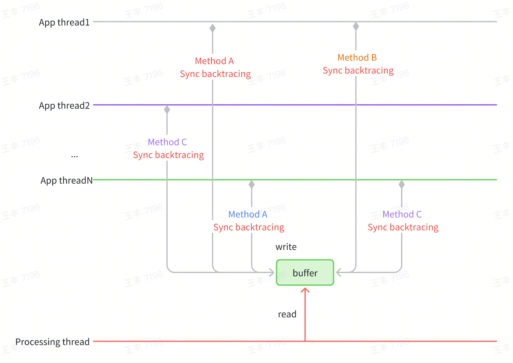
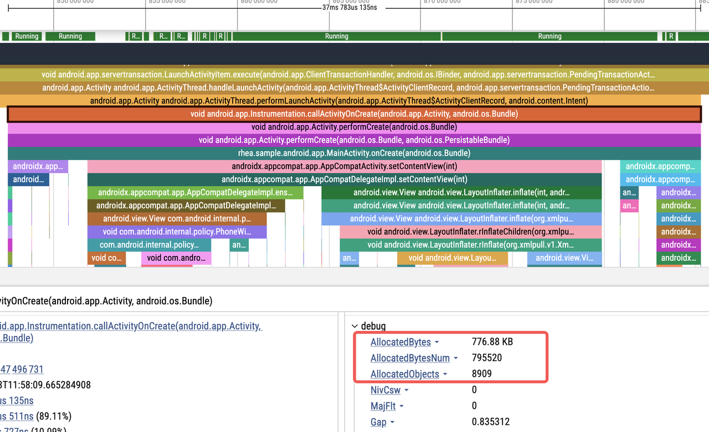

[（中文版）btrace 3.0 重磅新增 iOS 支持！免插桩原理大揭秘！](INTRODUCTION.zh-CN.MD)

# Backgrounds

Since the release of btrace 2.0 nearly two years ago, we have gathered substantial user feedback. Key issues include:

- **High Integration and Maintenance Costs**: Complex plugin configurations, increased build time due to compile-time instrumentation, and potential compilation failures from bytecode instrumentation errors negatively impact user experience.
- **Lack of System Method Information**: The compile-time bytecode instrumentation scheme only works for methods packaged in the APK. Because it fails to capture system methods (e.g., Android framework), the trace data is insufficient, which hinders further performance analysis.

Furthermore, as cross-platform collaboration grows, industry demand for iOS tracing capabilities has surged. However, Apple's official Time Profiler has some limitations:

- **High Usage Threshold**: Complex UI and insufficient documentation make issue debugging time-consuming.
- **Low Flexibility**: The Time Profiler tool is a black box, making it impossible to troubleshoot issues when they occur, and neither data dimensions nor data display methods can be customized.

To address these pain points—improving user experience, enriching trace data, reducing performance overhead, and adding iOS support, we have embarked on exploring a brand-new tracing solution.

# Design Philosophy

The core problem with btrace 2.0 stemmed from its compile-time bytecode instrumentation approach. We therefore explored an alternative tracing solution.
Two distinct approaches exist for tracing in current industry practice: code instrumentation and sampling backtracing. Below is a comparison of their advantages and disadvantages:

| | **Code Instrumentation** | **Sampling Backtracing** |
| --- | --- | --- |
| **Advantages** | - Precise execution time capture for instrumented functions<br>- Rich runtime data (e.g., memory allocation, lock contention)<br>- Guaranteed collection of instrumented code | - Adjustable sampling rate to control performance impact<br>- Captures overall runtime behavior<br>- No source code modification required |
| **Disadvantages** | - Increased app size<br>- Performance overhead for high-frequency functions<br>- Requires code/artifact modification, longer build time<br>- No dynamic adjustment after release | - Approximate execution time<br>- Limited data (no memory or lock details)<br>- Sampling randomness may miss edge cases |

Sampling backtracing offers benefits like system method tracing, dynamic enable or disable, and lower access costs. However, the periodic asynchronous backtracing process used in the sampling approach causes precision and performance issues:

- Performance Overhead: Thread suspension, stack backtracking, and resume operations are costly.
- Scheduling Uncertainty: Due to thread scheduling, trapping intervals often exceed 10ms, making it impossible to guarantee the accuracy of the tracing.

To combine the best of both approaches, btrace 3.0 introduces a hybrid solution of dynamic instrumentation and synchronous backtracing:

- Synchronous backtracing: Eliminates thread suspension/resume overhead by  backtracing directly on target threads.
- Dynamic Instrumentation: Uses dynamic instrumentated trace points as triggers for synchronous backtracing.



Key to Precision: Instrumentation points must be selected from high-frequency "leaf node" methods (e.g., function endpoints). Missing leaf node points can lead to incomplete trace data.


However, synchronous backtracing is highly dependent on instrumentation points. In extreme cases, such as when there are no suitable instrumentation points in the method logic itself or the thread is blocked, the corresponding trace information cannot be collected. To address this issue, asynchronous backtracing can be used to further improve the richness of trace data. In particular, the iOS system has high asynchronous backtacing performance, making it suitable to combine asynchronous backtacing and synchronous backtacing to further enhance the richness of trace data.


# Technical Details

## Android Implementation

The Android solution comprises synchronous backtracing and dynamic instrumentation:

### Efficient Backtracing

Android's native `Thread.getStackTrace()` parses method symbols during backtracing, which is inefficient for high-frequency use. btrace 3.0 optimizes by:

- Storing only method pointers during backtracing and batch-symbolizing them later to avoid redundant parsing.
- Using ART's StackVisitor for backtracing, with version compatibility ensured via a mSpaceHolder buffer to avoid hardcoding memory layouts.

``` C++
class StackVisitor {
...
    [[maybe_unused]] virtual bool VisitFrame();
    
    // preserve for real StackVisitor's fields space
    [[maybe_unused]] char mSpaceHolder[2048]; 
...
};

bool StackVisitor::innerVisitOnce(JavaStack &stack, void *thread, uint64_t *outTime,
                                  uint64_t *outCpuTime) {
    StackVisitor visitor(stack);

    void *vptr = *reinterpret_cast<void **>(&visitor);
    // art::Context::Create()
    auto *context = sCreateContextCall();
    // art::StackVisitor::StackVisitor(art::Thread*, art::Context*, art::StackVisitor::StackWalkKind, bool)
    sConstructCall(reinterpret_cast<void *>(&visitor), thread, context, StackWalkKind::kIncludeInlinedFrames, false);
    *reinterpret_cast<void **>(&visitor) = vptr;
    // void art::StackVisitor::WalkStack<(art::StackVisitor::CountTransitions)0>(bool)
    visitor.walk();
}

[[maybe_unused]] bool StackVisitor::VisitFrame() {
    // art::StackVisitor::GetMethod() const
    auto *method = sGetMethodCall(reinterpret_cast<void *>(this));
    mStack.mStackMethods[mCurIndex] = uint64_t(method);
    mCurIndex++;
    return true;
}
```

This approach balances performance, compatibility, and maintainability.

### Dynamic Instrumentation

Leveraging the ShadowHook runtime hook tool, instrumentation points are inserted at high-frequency "leaf node" methods:

- Memory Allocation: Hook Java object creation events via a custom AllocationListener (avoiding VM-wide thread suspension risks).
- Frequency Control: To reduce overhead, backtracing is sampled based on time intervals between allocations.
- Blocking Operations: Hook `MonitorEnter`, `Object.wait`, `Unsafe.park`, GC and other blocking points to record both stack traces and blocking durations.

Take the scenario of acquiring a lock as an example. Ultimately, lock acquisition will proceed to MonitorEnter in the Native layer, and the execution of this function can be proxied through shadowhook:

``` C++
void Monitor_Lock(void* monitor, void* threadSelf) {
    SHADOWHOOK_STACK_SCOPE();
    rheatrace::ScopeSampling a(rheatrace::stack::SamplingType::kMonitor, threadSelf);
    SHADOWHOOK_CALL_PREV(Monitor_Lock, monitor, threadSelf);
}

class ScopeSampling {
private:
    uint64_t beginNano_;
    uint64_t beginCpuNano_;
public:
    ScopeSampling(SamplingType type, void *self = nullptr, bool force = false) : type_(type), self_(self), force_(force) {
        beginNano_ = rheatrace::current_time_nanos();
        beginCpuNano_ = rheatrace::thread_cpu_time_nanos();
    }

    ~ScopeSampling() {
        SamplingCollector::request(type_, self_, force_, true, beginNano_, beginCpuNano_);
    }
};
```

## iOS Implementation

The iOS side adopts a tracing approach combining synchronous and asynchronous backtracing.

- Synchronous backtracing: Hook high-frequency methods like Android (e.g., memory allocation, I/O, locks) identified via `dtruss` profiling.
- Asynchronous backtracing: Periodically sample all threads to ensure data continuity, with optimizations to avoid deadlocks and reduce overhead.

### Storage Optimization

**Spatial locality**

Stores unique stack nodes to eliminate duplicate entries.

``` C++
class CallstackTable
{
public:
    struct Node
    {
        uint64_t parent;
        uint64_t address;
    };
    
    struct NodeHash {
        size_t operator()(const Node* node) const {
            size_t h = std::hash<uint64_t>{}(node->parent);
            h ^= std::hash<uint64_t>{}(node->address);
            return h;
        }
    };
    
    struct NodeEqual
    {
        bool operator()(const Node* node1, const Node* node2) const noexcept
        {
            bool result = (node1->parent == node2->parent) && (node1->address == node2->address);
            return result;
        }
    };

    using CallStackSet = hash_set<Node *, NodeHash, NodeEqual>;
private:
    CallStackSet stack_set_;
};
```

Take the following diagram as an example to illustrate how to store callstacks efficiently.


1. Method A in Sample 1 has no parent method, so it is stored as Node(0, A), and the address of the Node is recorded as NodeA.
2. Method B in Sample 1 has Method A as its parent, so it is stored as Node(NodeA, B), and the address of the Node is recorded as NodeB.
3. Method C in Sample 1 has Method B as its parent, so it is stored as Node(NodeB, C), and the address of the Node is recorded as NodeC.
4. The Node corresponding to Method A in Sample 2 is Node(0, A), which has already been stored, so it is not stored again.
5. Similarly, Methods B and C in Sample 2 are not stored again.
6. Method A in Sample 3 is not stored again.
7. Method E in Sample 3 is stored as Node(NodeA, E).
8. Method C in Sample 3 is stored as Node(NodeE, C).

**Temporal locality**

By merging adjacent records with identical call stacks and storing only the start and end records, the storage can be significantly reduced.


### Concurrency Control

Multiple sub-buffers are used to parallelize thread writes, avoiding lock contention while balancing memory usage.


### Asynchronous Backtracing

- Deadlock Prevention: Restrict dangerous API calls (e.g., ObjC methods,malloc, NSLog) during sampling.
- Active Thread Filtering: Only sample non-idle threads to reduce overhead.
- Safe Backtracing: Use vm_read_overwrite for invalid pointers while prioritizing direct memory reads for performance.

## Trace Visualization

Both platforms use Perfetto for visualization, similar to Android's Debug.startMethodTracingSampling. The core logic compares consecutive stacks to compute function execution times by tracking stack differences.

``` Java
// Generate a virtual Root node
CallNode root = CallNode.makeRoot();
Stack<CallNode> stack = new Stack<>();
stack.push(root);
...
for (int i = 0; i < stackList.size(); i++) {
    StackItem curStackItem = stackList.get(i);
    nanoTime = curStackItem.nanoTime;
    // Push all elements of the first callstack onto the stack.
    if (i == 0) {
        for (String name : curStackItem.stackTrace) {
            stack.push(new CallNode(curStackItem.tid, name, nanoTime, stack.peek()));
        }
    } else {
        // Compare the current stack with the previous stack from top to bottom to find the first differing function.
        StackItem preStackItem = stackList.get(i - 1);
        int preIndex = 0;
        int curIndex = 0;
        while (preIndex < preStackItem.size() && curIndex < curStackItem.size()) {
            if (preStackItem.getPtr(preIndex) != curStackItem.getPtr(curIndex)) {
                break;
            }
            preIndex++;
            curIndex++;
        }
        // Pop all functions from the previous callstack up to the first differing function.
        for (; preIndex < preStackItem.size(); preIndex++) {
            stack.pop().end(nanoTime);
        }
        // Push all differing functions in the current callstack onto the stack.
        for (; curIndex < curStackItem.size(); curIndex++) {
            String name = curStackItem.get(curIndex);
            stack.push(new CallNode(curStackItem.tid, name, nanoTime, stack.peek()));
        }
    }
}
// Pop all remaining functions from the stack.
while (!stack.isEmpty()) {
    stack.pop().end(nanoTime);
}
```

Limitations: Sampling-based methods may overestimate durations for overlapping stacks. Mitigations include tracking message IDs to distinguish unrelated executions.


Finally, let's take a look at the results. The following is the trace data of the btrace demo during the app startup phase. It can be seen that both the richness and details have significantly improved compared to btrace 2.0.


## Data Insights

btrace 3.0 captures rich metrics.

### CPU Time

Differentiate between on-CPU execution and off-CPU blocking (e.g., locks, I/O).

The implementation is very simple. We can obtain the current thread's CPU time in the following way each time a stack is captured:

``` C++
static uint64_t thread_cpu_time_nanos() {
    struct timespec t;
    clock_gettime(CLOCK_THREAD_CPUTIME_ID, &t);
    return t.tv_sec * 1000000000LL + t.tv_nsec;
}
```


### Object Allocation

Track allocation counts and sizes at thread level.

``` C++
thread_local rheatrace::JavaObjectStat::ObjectStat stats;

void rheatrace::JavaObjectStat::onObjectAllocated(size_t b) {
    stats.objects++;
    stats.bytes += b;
}
```




### Page faults and context switches

Similar to CPU time, the number of page faults and context switches at the thread level can be read via getrusage.

``` C++
struct rusage ru;
if (getrusage(RUSAGE_THREAD, &ru) == 0) {
    r.mMajFlt = ru.ru_majflt;
    r.mNvCsw = ru.ru_nvcsw;
    r.mNivCsw = ru.ru_nivcsw;
}
```


### Thread blocking

 By hooking the corresponding functions, we can record the blocking duration of the main thread. At the same time, we hook operations such as lock release. If the released lock is the one that the current main thread is waiting for, we forcefully capture the stack at the moment of lock release and record the ID of the currently released target thread to correlate the relationship between blocking and release.

 ``` C++
static void *currentMainMonitor = nullptr;
static uint64_t currentMainNano = 0;

void *Monitor_MonitorEnter(void *self, void *obj, bool trylock) {
    SHADOWHOOK_STACK_SCOPE();
    if (rheatrace::isMainThread()) {
        rheatrace::ScopeSampling a(rheatrace::SamplingType::kMonitor, self);
        currentMainMonitor = obj; // 记录当前阻塞的锁
        currentMainNano = a.beginNano_;
        void *result = SHADOWHOOK_CALL_PREV(Monitor_MonitorEnter, self, obj, trylock);
        currentMainMonitor = nullptr; // 锁已经拿到，这里重置
        return result;
    }
    ...
}

bool Monitor_MonitorExit(void *self, void *obj) {
    SHADOWHOOK_STACK_SCOPE();
    if (!rheatrace::isMainThread()) {
        if (currentMainMonitor == obj) { // 当前释放的锁正式主线程等待的锁
           rheatrace::SamplingCollector::request(rheatrace::SamplingType::kUnlock, self, true, true, currentMainNano); // 强制抓栈，并通过 currentMainNano 和主线程建立联系
            ALOGX("Monitor_MonitorExit wakeup main lock %ld", currentMainNano);
        }
    }
    return SHADOWHOOK_CALL_PREV(Monitor_MonitorExit, self, obj);
}
 ```

1. The main thread is waiting for a lock, with a prompt: "Woken up by thread ID 30657"


2. Easily locate the code related to thread 30657:


# Future Roadmap

1. Enhanced Capabilities: Add Native (C/C++) tracing on Android and GPU rendering tracing on both platforms.
2. Online Support: Enable tracing for online performance issues.
3. Ecosystem Building: Develop automated performance diagnosis tools around btrace.
4. Cross-Platform: Add HarmonyOS and Web support.

Finally, welcome everyone to discuss and exchange ideas at any time, and work together to build the ultimate btrace tool!