[English](INTRODUCTION.MD)

# 背景说明

自 btrace 2.0 正式发布以来，已近两年时间。在此期间，我们收到了大量用户反馈，经总结，主要问题如下：

- **接入维护成本较高**：接入、使用及维护的成本均偏高，对用户的使用体验产生了影响。接入的插件配置较为复杂，编译期插桩致使构建耗时增加，接入后字节码插桩异常会导致无法正常编译，且问题原因难以排查。
- **系统方法信息缺失**：编译期的字节码插桩方案仅能对打包至 apk 内的方法生效，无法对 android framework 等系统方法生效，导致所采集的 Trace 信息不够丰富，影响后续的性能分析。

除 android 端团队针对 2.0 版本给出的反馈外，随着行业内双端合作愈发紧密，业界对于 iOS 相关能力的需求也十分迫切。然而，苹果官方所提供的 Trace 方案 Time profiler 存在以下局限： 

- **使用成本居高**：Time profiler 的界面比较复杂，配套的说明文档数量较少，使用 Time profiler 定位问题时需要消耗很多精力。 
- **应用灵活性低**：Time profiler 工具是一个黑盒，出现问题时无法排查，且无法自定义数据维度和数据展示方式。
对此，为了持续提升用户使用体验、增强 Trace 信息丰富度、进一步降低性能损耗，以及对 iOS 端能力的支持，我们开启了全新的 Trace 方案的探索。

# 思路介绍

实际上不难看出，btrace 目前存在的问题主要是由其使用的编译期字节码插桩方案引起的，因此为了解决目前存在的问题，我们重点探索了编译期插桩之外的 Trace 采集方案。

目前业界主流的 Trace 采集方案分为两种：代码插桩方案和采样抓栈方案。那么采样抓栈方案是否就是更合适的方案呢，我们对两种方案的优缺点做了简单的总结：

| | **代码插桩** | **采样抓栈** |
|---|---|---|
| **优点** | - 可以精确地捕获插桩函数的执行时间<br>- 可以收集更多的运行时数据，如内存分配、锁竞争等<br>- 插桩代码一定会被采集，可对特定的函数进行整体分析 | - 可以调整控制采样率控制对应用程序的性能影响<br>- 可以捕获应用程序在运行时的整体行为<br>- 无需修改应用程序的源代码 |
| **缺点** | - 对应用程序的体积有较大负向影响<br>- 高频调用函数插桩后方法执行性能有较大影响<br>- 需要修改应用程序的代码或者产物，增加编译耗时<br>- 插桩代码编译时确定，发布后无法动态调整 | - 无法精确地捕获每个函数的执行时间，只能估算<br>- 无法收集堆栈外的运行时数据，如内存分配、锁竞争等<br>- 采样具有随机性，无法全局了解特定函数的整体情况 |

从上述对比可以看出，两种方案各有优劣。采样抓栈方案可以追踪到系统方法的执行、可以动态开启或关闭、接入和维护成本也相对较低，但是它在 Trace 精度和性能上存在明显的不足，核心原因在于采样抓栈采用的是定期的异步抓栈流程。首先是每次抓栈都需要经历挂起线程、回溯方法栈、恢复线程三个阶段，这三个阶段都有着明显的性能损耗。其次后台线程的定时任务由于线程调度的原因，无法做到精准的调度，以及线程挂起时机的不确定性，导致抓栈的间隔至少都设置在 10 毫秒以上，trace 的精度无法保证。

既然两种方案各有优劣，我们能否取长补短，将两种方案的优势融合呢？答案是肯定的，将异步抓栈改成直接在目标线程进行同步抓栈来免去线程挂起和恢复带来的性能损耗，再通过动态插桩提供的插桩点作为同步抓栈的驱动时机，最终就形成了 btrace 3.0 所采用的动态插桩和同步抓栈结合的 Trace 采集新方案。

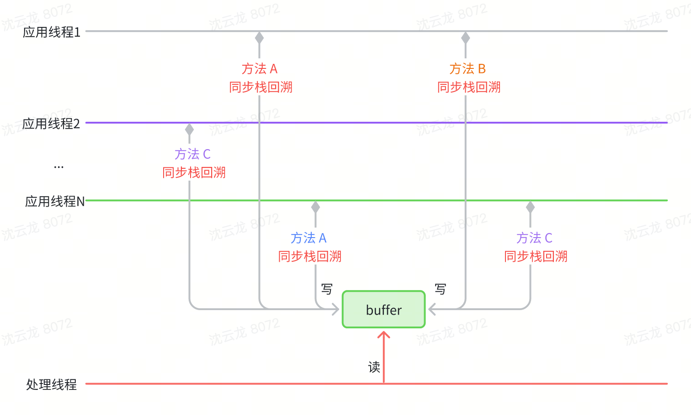

新方案将如何保证 Trace 的精度呢？这对应着动态插桩的插桩点选取策略，也即寻找同步抓栈的最佳时机。实际上只要保证插桩点在线程运行时能够被高频地执行到，我们就可以通过高频地同步抓栈来保证 Trace 的精度。另外还需要注意的是，插桩点的选取不仅要保证能够被高频地执行到，同时也要尽可能的分布在“叶子节点”所处的方法上。如下图所示，如果“叶子节点”方法上没有插桩点，那么最终生成的 Trace 就会存在信息丢失。如何实现快速同步抓栈、如何进行动态插桩以及具体选取哪些插桩点将在方案明细中介绍。

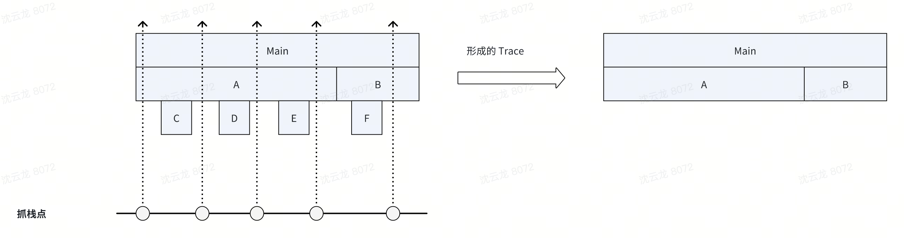

值得一提的是，同步抓栈方案除了免去线程挂起和恢复的性能损耗以外，还可以在抓栈时记录当前线程的更多上下文信息，更进一步地结合了插桩与抓栈的双重优势，这方面也将在下文的方案中进行阐述。

然而，同步抓栈高度依赖桩点。若遇到极端情况，如方法逻辑本身不存在合适的桩点，或者线程被阻塞，便无法采集到相应的 Trace 信息。针对此问题，可通过异步抓栈进一步提高 Trace 的丰富度。特别是 iOS 系统，其自身具备极高的异步抓栈性能，适合在同步抓栈的基础上叠加异步抓栈功能，以进一步提升 Trace 的丰富度。 

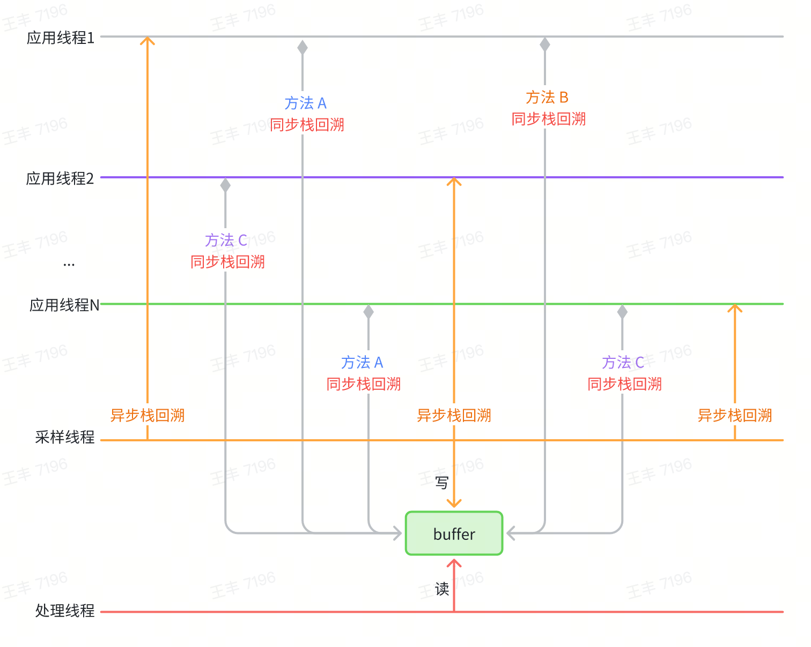

# 方案明细

接下来，我们将对双端的技术细节展开深入探讨。鉴于系统差异，双端的实现原理存在区别，以下将分别进行介绍。 

## Android

Android 端的 Trace 采集方案主要分为同步抓栈和动态插桩两部分，其中同步抓栈部分由于已经免去了线程挂起和恢复流程，所以只需要聚焦于如何实现快速的方法抓栈即可。

### 快速抓栈

Android Framework 本身提供的抓栈方式 Thread.getStackTrace 会在抓栈的同时解析方法符号，解析符号是比较耗时的操作。针对 Trace 采集需要高频率抓栈的场景，每次抓栈都解析方法符号显然是比较浪费性能的选择，尤其是多次抓栈里很可能会存在很多重复的方法符号解析。为了优化抓栈性能，我们选择在抓栈时仅保存方法的指针信息，待抓栈完成后，进行 Trace 数据上报时对指针去重后进行批量符号化，这样可以最大化节省解析符号的成本。

具体该如何实现快速抓栈且仅保存方法指针信息呢？在 Android 中 Java 方法的栈回溯主要依赖 ART 虚拟机内部的 [StackVisitor](https://cs.android.com/android/platform/superproject/+/master:art/runtime/stack.h) 类来实现的，大部分的快速抓栈方案都是围绕着创建 StackVisitor 的实现类对象并调用其 WalkStack（） 方法进行回溯来实现的，我们也是使用这种方案。只有少数方案如 Facebook 的 [profilo](https://github.com/facebookarchive/profilo) 是不依赖系统 StackVisitor 类自己实现的栈回溯，但是这种方案的兼容性较差且有较高的维护成本，目前随着 Android 版本的不断更新，profilo 官方已无力再对新版本进行更新适配了。

不过在使用系统的 StackVisitor 类进行栈回溯时我们也做了一些额外的版本适配方案的优化。具体来说是构造 StackVisitor 对象的方案优化，我们不假定 StackVisitor 类内成员变量的内存布局，而是定义了一个内存足够的 mSpaceHolder 字段来容纳 StackVisitor 对象的所有成员变量。

``` C++
class StackVisitor {
...
    [[maybe_unused]] virtual bool VisitFrame();
    
    // preserve for real StackVisitor's fields space
    [[maybe_unused]] char mSpaceHolder[2048]; 
...
};
```

然后交由 ART 提供的构造函数来妥善初始化 StackVisitor 对象，自动将预留的 mSpaceHolder 初始化成预期的数据，省去了对每个版本的对象内存布局适配工作。同时再将 StackVisitor 对象的虚函数表替换，最后实现类似继承自 StackVisitor 的效果。

``` C++
bool StackVisitor::innerVisitOnce(JavaStack &stack, void *thread, uint64_t *outTime,
                                  uint64_t *outCpuTime) {
    StackVisitor visitor(stack);

    void *vptr = *reinterpret_cast<void **>(&visitor);
    // art::Context::Create()
    auto *context = sCreateContextCall();
    // art::StackVisitor::StackVisitor(art::Thread*, art::Context*, art::StackVisitor::StackWalkKind, bool)
    sConstructCall(reinterpret_cast<void *>(&visitor), thread, context, StackWalkKind::kIncludeInlinedFrames, false);
    *reinterpret_cast<void **>(&visitor) = vptr;
    // void art::StackVisitor::WalkStack<(art::StackVisitor::CountTransitions)0>(bool)
    visitor.walk();
}
```

最后当调用 StackVisitor.walk 后，相关回调都将分发到我们自己的 VisitFrame，这样只需要再调用相关函数进行堆栈数据读取即可。

``` C++
[[maybe_unused]] bool StackVisitor::VisitFrame() {
    // art::StackVisitor::GetMethod() const
    auto *method = sGetMethodCall(reinterpret_cast<void *>(this));
    mStack.mStackMethods[mCurIndex] = uint64_t(method);
    mCurIndex++;
    return true;
}
```

这种方案在性能和兼容性方面能同时得到保障，维护成本也低。

### 动态插桩

现在可以实现快速抓栈了，那么应该在什么时候抓栈呢？这就轮到动态插桩出场了，所谓的动态插桩是利用运行时的 Hook 工具对系统内部的方法进行 Hook 并插入同步抓栈的逻辑，目前主要使用到的 Hook 工具为 [ShadowHook](https://github.com/bytedance/android-inline-hook)。

按照前文思路分析，对于动态插桩重点是高频且尽可能分布在“叶子节点”方法上。而在 Android 应用中 Java 对象的创建是虚拟机运行过程中除方法调用外最高频的操作，并且对象创建时的内存分配会调用任何业务逻辑，是整个方法执行的末端。于是，第一个理想的抓栈时机即是 Java 对象创建时的内存分配。

Java 对象创建监控的核心是向虚拟机注册对象创建的监听器，这个能力虚拟机的 Heap 类已经提供有注册接口，但是通过该接口注册首先会暂停所有 Java 线程，这会存在很高的 ANR 风险，为此我们借鉴了公司内部开发的 Java 对象创建方案，实现了实时的 Java 对象创建监控能力，具体实现原理请移步查看仓库源码，这里不作详细介绍。

注册完 AllocationListener 后将在每次对象分配时收到回调：

``` C++
class MyAllocationListener : AllocationListener {
    ...
    void ObjectAllocated(void *self, void **obj, size_t byte_count) override {
        // do backtracing here
    }
};
```

因为对象分配十分高频，如果每次都进行抓栈会有很大的性能损耗。一方面大批量的抓栈开销累计会有很大的性能成本，另一方面如此存储大规模的抓栈数据也是棘手的问题。

为控制抓栈数量以减少性能损耗，首先可考虑的方法是控频：通过对比连续两次内存回调的间隔时间，仅当该时间间隔大于阈值时才再次进行抓栈操作。 

``` C++
thread_local uint64_t lastNano = 0;

bool SamplingCollector::request(SamplingType type, void *self, bool force, bool captureAtEnd, uint64_t beginNano, uint64_t beginCpuNano, std::function<void(SamplingRecord&)> fn) {
    auto currentNano = rheatrace::current_time_nanos();
    if (force || currentNano - lastNano > threadCaptureInterval) {
        lastNano = currentNano;
        ...
        if (StackVisitor::visitOnce(r.mStack, self)) {
            collector->write(r);
            return true;
        }
    }
    return false;
}
```

除了内存分配以外，还可以通过丰富其他抓栈的时机来提升两次抓栈的时间密度，提升数据的效果。比如 JNI 方法调用、获取锁、Object.wait、Unsafe.park 等节点。这些叶子节点可以主要分为两大类：高频执行与阻塞执行。

高频执行是很好的进行主动抓栈的时间点，记录下当前执行的堆栈即可，比如前面介绍的内存分配、JNI 调用等。

阻塞执行即可能处于阻塞的状态等待满足条件后继续执行，对于此类节点，除了对应的执行堆栈外，还预期记录当前方法阻塞的耗时。可以在方法即将执行时记录开始执行时间，在方法结束时进行抓栈并记录结束时间。

这里以获取锁的的场景为例，获取锁最终会走到 Native 层的 MonitorEnter，可以通过 shadowhook 来代理该函数的执行：

``` C++
void Monitor_Lock(void* monitor, void* threadSelf) {
    SHADOWHOOK_STACK_SCOPE();
    rheatrace::ScopeSampling a(rheatrace::stack::SamplingType::kMonitor, threadSelf);
    SHADOWHOOK_CALL_PREV(Monitor_Lock, monitor, threadSelf);
}

class ScopeSampling {
private:
    uint64_t beginNano_;
    uint64_t beginCpuNano_;
public:
    ScopeSampling(SamplingType type, void *self = nullptr, bool force = false) : type_(type), self_(self), force_(force) {
        beginNano_ = rheatrace::current_time_nanos();
        beginCpuNano_ = rheatrace::thread_cpu_time_nanos();
    }

    ~ScopeSampling() {
        SamplingCollector::request(type_, self_, force_, true, beginNano_, beginCpuNano_);
    }
};
```

通过封装的 ScopeSampling 对象，可以在 Monitor_Lock 函数执行时记录方法的开始时间，待方法结束时记录结束时间的同时并进行抓栈。这样整个锁冲突的堆栈以及获取锁的耗时都会被完整的记录下来。

除了锁冲突以外，像 Object.wait、Unsafe.park、GC 等阻塞类型的耗时，都可以通过这样的方法同时记录执行堆栈与耗时信息。

至此 Android 端的核心原理基本完成介绍，欢迎移步源码进一步了解。

## iOS

下面来看 iOS 的原理，正如前文所述，iOS 具备高性能的异步抓栈方案，因此 iOS 端采用同步与异步结合采样的 Trace 采集方案：

- 同步抓栈：选定一批方法进行 hook，当这些方法被执行时，同步采集当前线程的 Trace 数据。
- 异步抓栈：当线程超过一定时间未被采集数据时，由独立的采样线程暂停线程，异步采集 Trace 数据然后恢复线程，以确保数据的时间连续性。

### 同步采集

同步采集模式在性能和数据丰富度方面都有一定优势。在同步采集模式下，我们遇到并解决了一些有挑战的问题：

- 选择同步采集点
- 减少存储占用
- 多线程数据写入性能

#### 选择同步采集点

**同步采集点的选取方法**

可能的选取方法有：

- 依靠 RD 同学的经验，但是存在不可持续性。
- 通过代码插桩，但是需要重新编译 app，其次无法获取到系统库方法，容易存在遗漏。

我们推荐检查 iOS app 高频系统调用，因为系统调用足够底层且对于 app 来说必不可少。可以在模拟器上运行 app，然后使用如下命令查看 app 运行时的系统调用使用情况：

```Bash
# 关闭sip
# 终端登录root账号
dtruss -c -p pid # -c表示统计系统调用的次数；
```

通过实际分析可知， iOS app 高频系统调用可以大致分为这几类：内存分配、I/O、锁、时间戳读取，如下所示：

``` YAML
名称                          次数
ulock_wake                   15346  # unfair lock, unlock
ulock_wait2                  15283  # unfair lock, lock
pread                        10758  # io
psynch_cvwait                10360  # pthread条件变量,等待
read                         9963   # io
fcntl                        8403   # io
mprotect                     8247   # memory
mmap                         8225   # memory
gettimeofday                 7531   # 时间戳
psynch_cvsignal              6862   # pthread条件变量，发送信号
writev                       6048   # io
read_nocancel                4892   # io
fstat64                      4817   # io
pwrite                       3646   # io
write_nocancel               3446   # io
close                        2850   # io
getsockopt                   2818   # 网络
stat64                       2811   # io
pselect                      2457   # io多路复用
psynch_mutexwait             1923   # mutex, lock
psynch_mutexdrop             1918   # mutex, unlock
psynch_cvbroad               1826   # pthread条件变量，发送广播信号
```

#### 减小存储占用

所采集的 Trace 数据中占用存储空间（内存和磁盘）最大的就是调用栈数据。调用栈具有时间和空间相似性，我们可以利用这些相似性来大幅压缩调用栈所占用的空间。

**空间相似性**

可以观察到，调用栈中越靠近上层的方法越容易是相同的，比如主线程的调用栈都以 main 方法开始。因此，我们可以将不同调用栈中相同层级的同名方法只存储一份来节省存储空间。我们设计了 CallstackTable 结构来存储调用栈：

``` C++
class CallstackTable
{
public:
    struct Node
    {
        uint64_t parent;
        uint64_t address;
    };
    
    struct NodeHash {
        size_t operator()(const Node* node) const {
            size_t h = std::hash<uint64_t>{}(node->parent);
            h ^= std::hash<uint64_t>{}(node->address);
            return h;
        }
    };
    
    struct NodeEqual
    {
        bool operator()(const Node* node1, const Node* node2) const noexcept
        {
            bool result = (node1->parent == node2->parent) && (node1->address == node2->address);
            return result;
        }
    };

    using CallStackSet = hash_set<Node *, NodeHash, NodeEqual>;
private:
    CallStackSet stack_set_;
};
```

 以下图为例介绍如何高效存储调用栈。

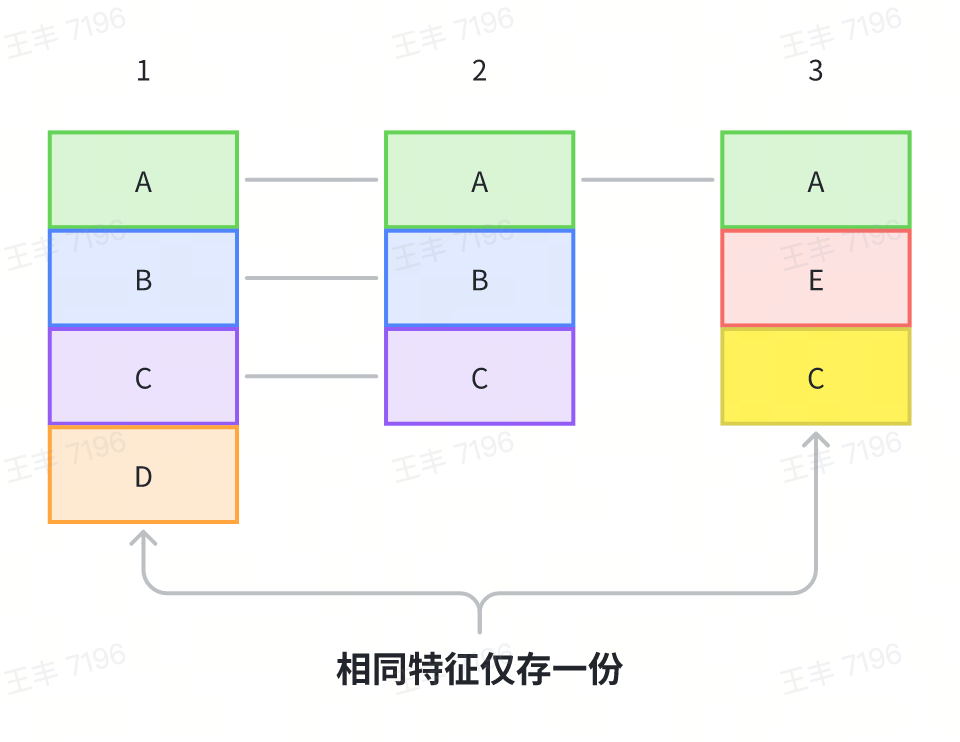

1. 样本 1 的`A`方法没有父方法，因此存储为 Node（0， A），并记录 Node 的地址为 NodeA
2. 样本 1 的`B`方法的父方法为`A`，因此存储为 Node（NodeA， B），并记录 Node 的地址为 NodeB
3. 样本 1 的`C`方法的父方法为`B`，因此存储为 Node（NodeB， C），并记录 Node 的地址为 NodeC
4. 样本 2 的`A`方法对应的 Node 为 Node（0， A），已经存储过，不再重复存储
5. 样本 2 的`B`方法和`C`方法同理不再重复存储
6. 样本 3 的`A`方法不再重复存储
7. 样本 3 的`E`方法存储为 Node（NodeA， E）
8. 样本 3 的`C`方法存储为 Node（NodeE， C）

**时间相似性**

App 中很多方法的执行时间都远大于我们的采集间隔，因此连续一段时间内采集到的调用栈很有可能是相同的。我们可以把相邻相同调用栈的记录进行合并，只存储开始和结束两条记录，就可以极大程度上减少存储空间占用。

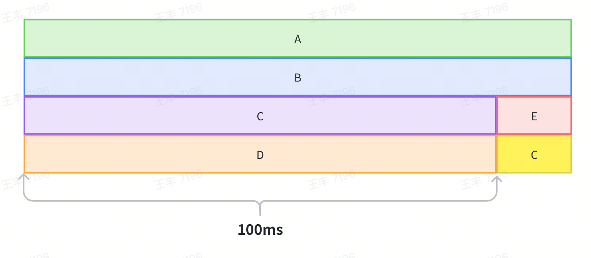

以上图为例进行说明，如果以 1ms 的间隔进行数据采集，而 A->B->C->D 栈执行了 100ms，那么就会采集到 100 条记录，由于这 100 条记录对应的是相同的栈，我们可以只记录开始和结束两条记录，从而大幅压缩存储占用。

#### 多线程数据写入

同步采集方案中，存在多线程同时写入数据到 buffer 的情况，必须对多线程写入进行处理，保证数据不异常。

一般通过加锁来保证数据安全，但是性能比较差。而 CAS 操作可以显著优于加锁，但是 lock-free 不等于 wait-free，也会有偶发性性能问题。还可以使用 Thread Local Buffer 的方案，其最大的优势是完全避免线程间冲突性能最优，但是容易造成内存浪费，需要仔细考虑内存复用机制。我们摒弃了以上传统方案，而是将单个 buffer 拆分为多个 sub buffer，将线程的每次写入操作根据线程 ID 和写入大小分配到各个 sub buffer，类似哈希机制来提升写入的并发度。

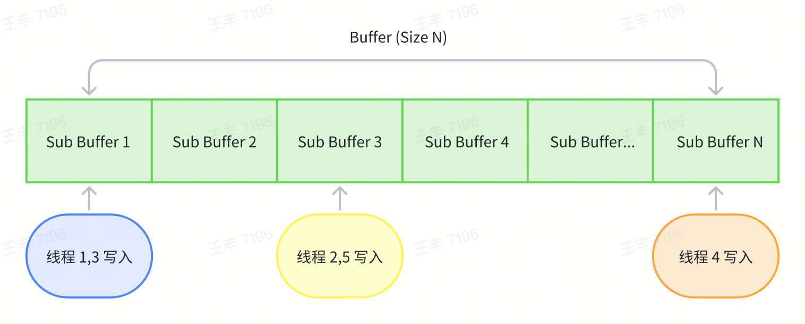

### 异步采集

异步抓栈方案相对成熟，Apple 官方的 Time Profiler 以及开源的 ETTrace 等项目均采用了该方案。抖音 iOS btrace 初版同样运用了异步抓栈方案。异步抓栈方案不可避免地需要先暂停线程执行，接着采集数据，最后恢复线程执行。此过程易出现死锁与性能问题，我们也对此进行了针对性处理。 

#### 防止死锁

当访问某些系统方法时，采集线程与被采集线程可能同时持有相同的锁。例如，在同时调用 malloc 进行内存分配时，可能会触发 malloc 内部的锁。当代码以如下方式被触发时，将会导致死锁：

1. 被采样线程调用 malloc 并首先获取锁；
2. 被采样线程被采样线程暂停执行；
3. 采样线程调用 malloc 并尝试获取锁，但是永远等不到锁释放。

最终，采样线程会陷入永久性的等待锁状态，被采样线程则会发生永久性暂停。 

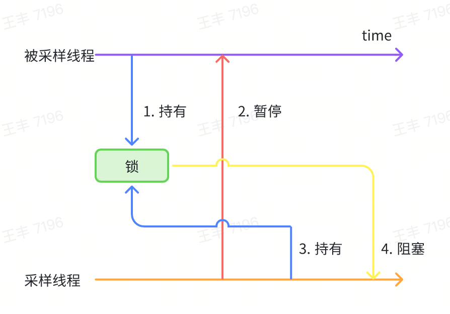

针对此类问题也没有特别好的处理办法，目前是通过一些约定禁止在采样线程在挂起被采样线程期间调用危险 api，类似于信号安全函数，具体已知的函数如下：

- ObjC 方法，因为 OC 方法动态派发时可能会持有内部锁
- 打印文本（printf 家族，NSlog 等）
- 堆内存分配（malloc 等）
- pthread 部分 api

#### 性能优化

**过滤非活跃线程**

抖音这种大型 App 在运行过程中会创建数量非常多的线程，如果每次采样都采集所有线程的数据，性能开销是无法接受的。同时，也没有必要每次都采集所有线程的数据，因为绝大多数线程在大部分时间里都在休眠，只有当事件发生时线程才会唤醒并处理执行任务，因此可以只采集活跃状态的线程的数据，同时，对长时间未被采集数据的线程强制采集一次数据。

``` C++
bool active(uint64_t thread_id) 
{
    mach_msg_type_number_t thread_info_count = THREAD_BASIC_INFO_COUNT;
    kern_return_t res = thread_info(thread_id, THREAD_BASIC_INFO, reinterpret_cast<thread_info_t>(info), &thread_info_count);
    if (unlikely((res != KERN_SUCCESS)))
    {
        return false;
    }

    return (info.run_state == TH_STATE_RUNNING && (info.flags & TH_FLAGS_IDLE) == 0);
}
```

**高效栈回溯**

异步回溯线程的调用栈时，为了防止读取到非法指针中的数据导致 app 崩溃，通常会使用系统库提供的 api vm_read_overwrite来读取数据，使用该 api 读取到非法指针的数据时会得到一个错误标识而不会导致 app 崩溃。虽然vm_read_overwrite已经足够高效（耗时在微秒级别），但其耗时相比于直接读指针的耗时仍然高了数十倍。而且 app 的调用栈通常都有数十层，因此vm_read_overwrite的高耗时问题会被放大。我们在回溯调用栈之前已经将线程暂停了，理论上线程的调用栈不会发生变化，所有的指针都应该是合法的，然而经过实际验证，直接读指针确实会读取到非法指针从而造成 app 崩溃。通过阅读暂停线程的 api thread_suspend的说明文档，以及分析崩溃日志，我们发现在一些情况下线程会继续运行（如线程正在执行退出时的清理动作）。

``` sql
The thread_suspend function increments the suspend count for target_thread and prevents the thread from executing any more user-level instructions.

In this context, a user-level instruction can be either a machine instruction executed in user mode or a system trap instruction, including a page fault. If a thread is currently executing within a system trap, the kernel code may continue to execute until it reaches the system return code or it may suspend within the kernel code. In either case, the system trap returns when the thread resumes.
```

最终，我们使用如下措施来尽可能使用直接读指针的方式以提升栈回溯的性能：

- 不采集正在退出的线程的数据
- 暂停线程后，再次确认线程运行状态，若线程已经暂停直接读指针进行栈回溯
- 否则兜底使用系统 api vm_read_overwrite 保证安全异步回溯调用栈

## Trace 生成

在介绍完双端的技术实现细节之后，接下来我们将关注 Trace 可视化部分。

在 Trace 可视化方面，双端都依旧选择了基于 perfetto 进行数据展示。具体逻辑与 Android 官方提供的 Debug.startMethodTracingSampling 的实现方案相似，此处以 Android 为例进行简要介绍，iOS 的实现情况大体一致。 

基本思路是对比连续抓取的栈信息之间的差异，找出从栈顶到栈底的第一个不同的函数。将前序堆栈中该不同的函数出栈，把后序堆栈中该不同的函数入栈，入栈和出栈的时间间隔即为该函数的执行耗时。以下是代码示例：

``` Java
// 生成一个虚拟的 Root 节点，待完成解析后，Root 的子树便构成了 Trace 的森林
CallNode root = CallNode.makeRoot();
Stack<CallNode> stack = new Stack<>();
stack.push(root);
...
for (int i = 0; i < stackList.size(); i++) {
    StackItem curStackItem = stackList.get(i);
    nanoTime = curStackItem.nanoTime;
    // 第一个堆栈全部入栈
    if (i == 0) {
        for (String name : curStackItem.stackTrace) {
            stack.push(new CallNode(curStackItem.tid, name, nanoTime, stack.peek()));
        }
    } else {
        // 当前堆栈与前一个堆栈对比，自顶向下，找到第一个不同的函数
        StackItem preStackItem = stackList.get(i - 1);
        int preIndex = 0;
        int curIndex = 0;
        while (preIndex < preStackItem.size() && curIndex < curStackItem.size()) {
            if (preStackItem.getPtr(preIndex) != curStackItem.getPtr(curIndex)) {
                break;
            }
            preIndex++;
            curIndex++;
        }
        // 前一个堆栈中不同的函数全部出栈
        for (; preIndex < preStackItem.size(); preIndex++) {
            stack.pop().end(nanoTime);
        }
        // 当前堆栈中不同的函数全部入栈
        for (; curIndex < curStackItem.size(); curIndex++) {
            String name = curStackItem.get(curIndex);
            stack.push(new CallNode(curStackItem.tid, name, nanoTime, stack.peek()));
        }
    }
}
// 遗留在栈中的函数全部出栈
while (!stack.isEmpty()) {
    stack.pop().end(nanoTime);
}
```

敏锐的读者或许已经察觉到，由于采用的是采样抓栈方式，因此可能出现多次抓栈时堆栈完全相同，但这些情况可能并非源自同一次代码执行的情形。以下图为例：

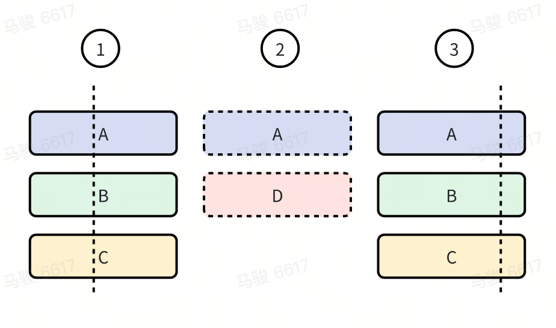

有 3 次不同的执行堆栈，但是由于采样的原因，仅 1 和 3 被采样抓栈。按照上面的规则生成 Trace，那么 B 和 C 的方法耗时都会被放大，包含了方法 D 的耗时。

很遗憾，对于此类情况无法彻底解决掉，但是可以针对特定的问题进行规避。比如针对消息执行的场景，可以设计一个消息 ID 用于标记消息，每次执行 nativePollOnce 后消息 ID 自增，在每次抓栈时同时记录消息 ID。这样就算多次抓栈结果一致，但是只要消息 ID 不一样，依然可以识别出来从而在解析 Trace 时结束方法。

最后我们再看下数据效果，下面是 btrace demo 在启动阶段的 Trace 数据，可以看到丰富度和细节上相比于 2.0 有了明显的提升。

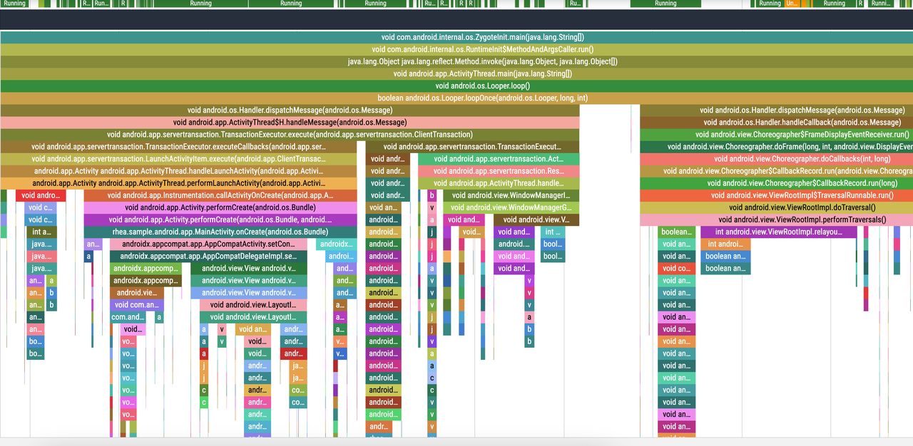

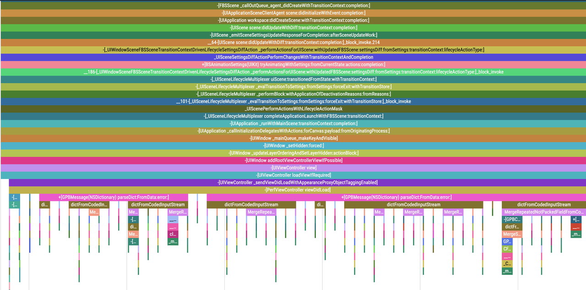

## 耗时归因数据

除基本的方法执行 Trace 外，不仅要了解方法的耗时情况，还需明确方法产生耗时的原因。为此，我们需要进一步剖析方法的耗时原因，深入分析 WallTime 的具体去向，例如在 CPU 执行上花费了多少时间、有多少时间处于阻塞状态等信息。得益于整体方案的设计，我们在每次进行栈抓取时采集包含 WallTime 在内的额外信息，从而能够轻松实现函数级的数据统计。 这部分数据采集的原理在双端是类似的，篇幅有限，这里仅以 Android 为例展开介绍。

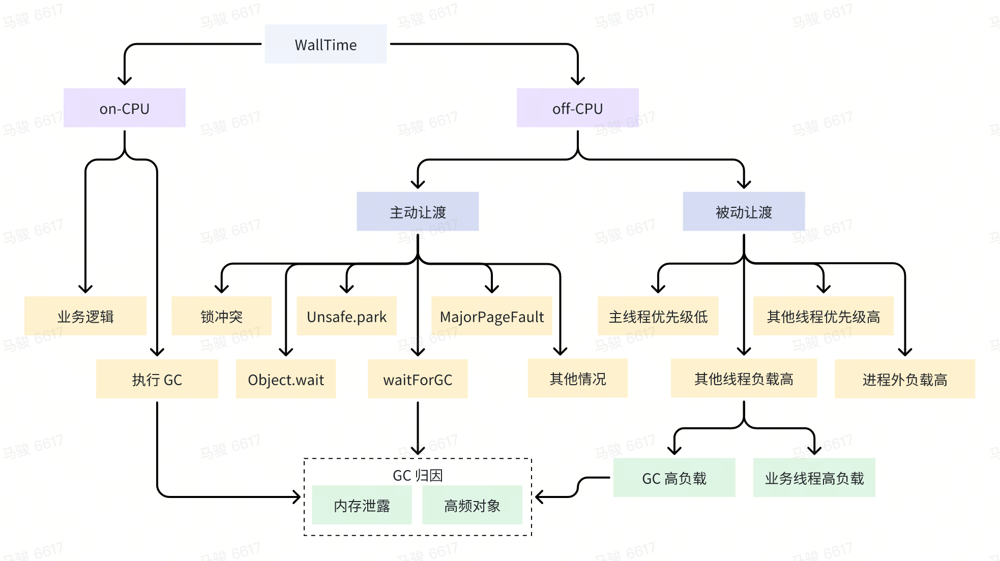

### CPUTime

CPUTime 是最基础的耗时归因数据，可以直观体现当前函数是在执行 CPU 密集型任务，还是在等待资源。
实现方式很简单，就是在每次抓栈时通过下面的方式获取下当前线程的 CPUTime：

``` C++
static uint64_t thread_cpu_time_nanos() {
    struct timespec t;
    clock_gettime(CLOCK_THREAD_CPUTIME_ID, &t);
    return t.tv_sec * 1000000000LL + t.tv_nsec;
}
```

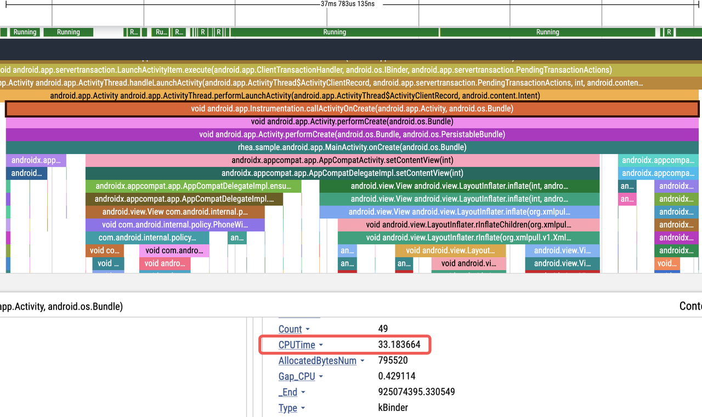

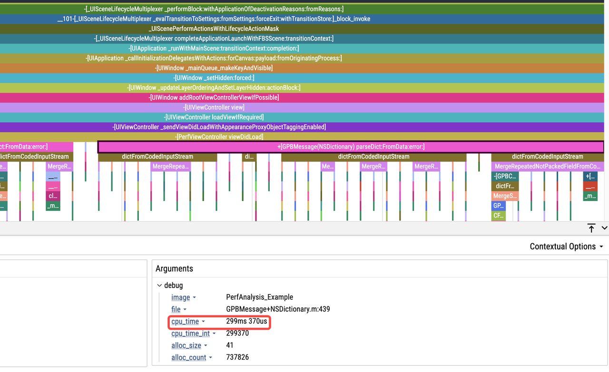

### 对象分配次数与大小

我们已借助对象分配的接口进行栈捕获，但并非每次对象分配时都会进行栈捕获，这会致使直接通过该接口采集的数据为抽样结果，无法真实反映对象分配所需的内存大小。实际上，我们只需在对象分配接口中做好数据统计，随后在每次进行栈捕获时（无论由何种断点触发），记录当前的线程级对象分配情况，与获取线程的 CPU 时间的操作方式相同即可。

``` C++
thread_local rheatrace::JavaObjectStat::ObjectStat stats;

void rheatrace::JavaObjectStat::onObjectAllocated(size_t b) {
    stats.objects++;
    stats.bytes += b;
}
```

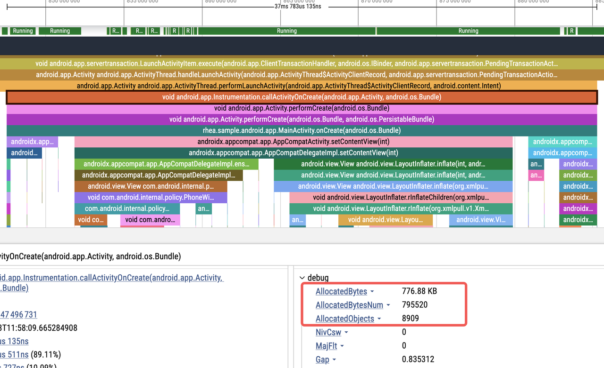

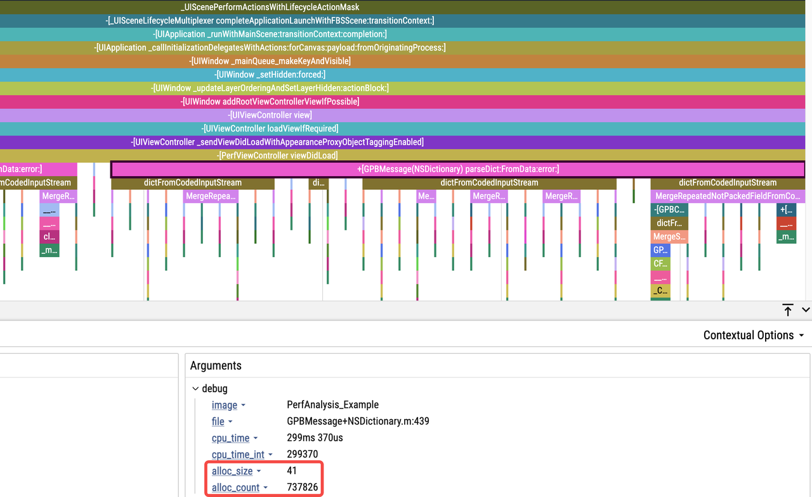

### 缺页次数、上下文切换次数

和 CPUTime 类似，可以通过 getrusage 来读取线程级别的缺页次数、上下文切换次数的信息。

``` C++
struct rusage ru;
if (getrusage(RUSAGE_THREAD, &ru) == 0) {
    r.mMajFlt = ru.ru_majflt;
    r.mNvCsw = ru.ru_nvcsw;
    r.mNivCsw = ru.ru_nivcsw;
}
```

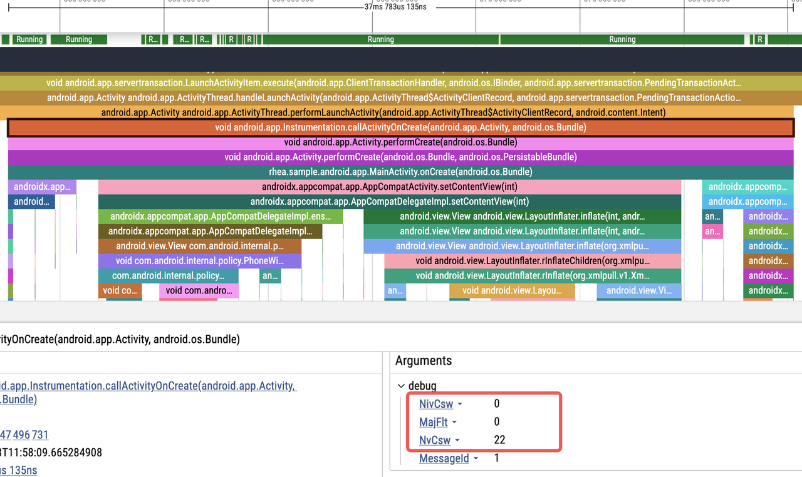

### 线程阻塞归因

以主线程为例，线程阻塞归因是监控到主线程阻塞的时长，以及对应的唤醒线程。目前阻塞归因已经包含 synchronized 锁、Object.wait、Unsafe.park 3 中原因导致的线程阻塞。通过 hook 对应的函数（hook 方案可以参考过往文章：[重要升级！btrace 2.0 技术原理大揭秘](https://mp.weixin.qq.com/s/WZ5JxCFv_FSOLqR-sRremA)）来记录主线程的阻塞时长，同时 hook 释放锁等操作，如果释放的锁是当前主线程正在等待的锁，那么就在释放锁时强制抓栈，且记录下当前释放的目标线程的 ID 用来关联阻塞与释放的关系。基本原理可以参考下面：

``` C++
static void *currentMainMonitor = nullptr;
static uint64_t currentMainNano = 0;

void *Monitor_MonitorEnter(void *self, void *obj, bool trylock) {
    SHADOWHOOK_STACK_SCOPE();
    if (rheatrace::isMainThread()) {
        rheatrace::ScopeSampling a(rheatrace::SamplingType::kMonitor, self);
        currentMainMonitor = obj; // 记录当前阻塞的锁
        currentMainNano = a.beginNano_;
        void *result = SHADOWHOOK_CALL_PREV(Monitor_MonitorEnter, self, obj, trylock);
        currentMainMonitor = nullptr; // 锁已经拿到，这里重置
        return result;
    }
    ...
}

bool Monitor_MonitorExit(void *self, void *obj) {
    SHADOWHOOK_STACK_SCOPE();
    if (!rheatrace::isMainThread()) {
        if (currentMainMonitor == obj) { // 当前释放的锁正式主线程等待的锁
           rheatrace::SamplingCollector::request(rheatrace::SamplingType::kUnlock, self, true, true, currentMainNano); // 强制抓栈，并通过 currentMainNano 和主线程建立联系
            ALOGX("Monitor_MonitorExit wakeup main lock %ld", currentMainNano);
        }
    }
    return SHADOWHOOK_CALL_PREV(Monitor_MonitorExit, self, obj);
}
```

1. 主线程等锁，提示 wakeupby: 30657

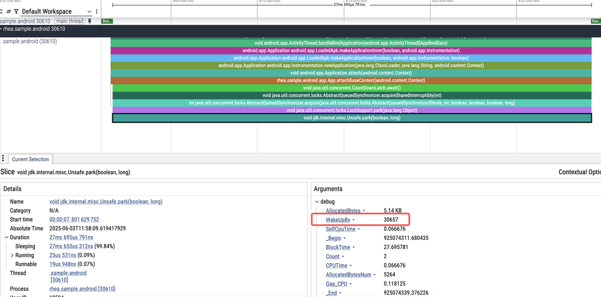

2. 轻松定位到 30657 线程相关代码：

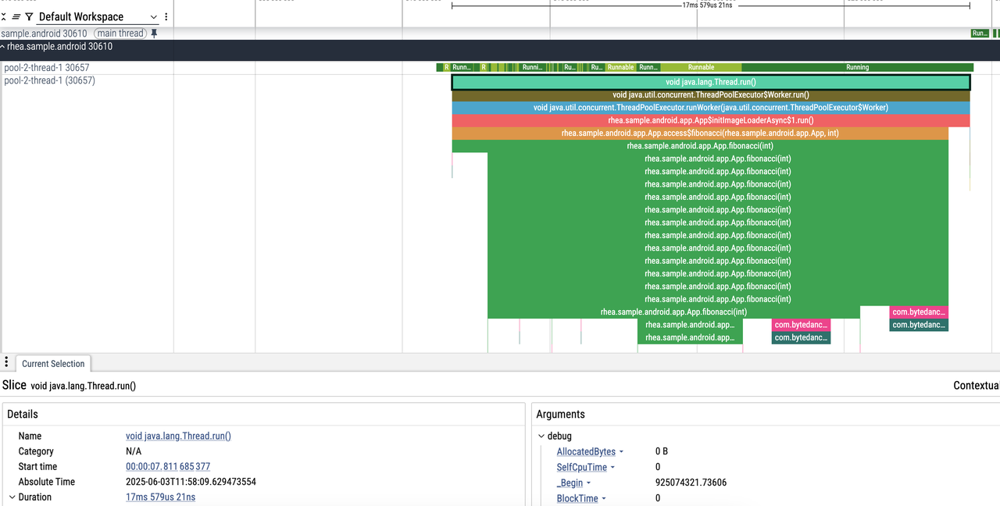

# 总结展望

以上主要阐述了 btrace 3.0 采用了将动态插桩与同步抓栈相结合的新型 Trace 方案。该新型方案在使用体验和灵活性方面对 btrace 进行了一定程度的优化。后续，我们将持续对 Trace 能力、拓展 Trace 采集场景以及生态建设进行迭代与优化，具体内容如下：

1. Trace 能力：在 Android 系统中支持 Native 层的 C/C++ Trace；在双端均提供 GPU 等渲染层面的 Trace 信息。
2. 使用场景：提供线上场景的 Trace 采集能力接入与使用方案，以助力发现并解决线上性能问题。
3. 生态建设：围绕 btrace 工具构建自动性能诊断能力。
4. 提升性能和稳定性：工具的性能和稳定性优化工作永无止境，仍需进一步追求极致。 
5. 多端能力：在 Android、iOS 的基础上，新增鸿蒙系统的支持，同时增加 Web 等跨平台的 Trace 能力。