# 背景介绍

在一年多前，我们对外正式开源了 btrace（AKA RheaTrace），它是基于 Systrace 的高性能 Trace 工具，目前字节跳动已经有接近 20 个业务团队使用 btrace 做日常性能优化工作。在这一年期间，我们收到很多社区以及公司内部反馈，包括使用体验、性能体验、监控数据等上都收到众多反馈，我们汇总了大家反馈的内容，主要包括以下三类：

-   **使用体验**：桌面脚本依赖 Systrace 和 Python 2.7 环境，导致环境搭建十分复杂，此外手机端还依赖外部存储访问权限，在初次使用时很容易导致打断。同时产物体积庞大，网页打开速度很慢。
-   **性能体验**：大型应用插桩数量达到百万级别，性能损耗接近 100%，对性能优化工作产生一定困扰。
-   **监控数据**：在 Trace 分析过程中，有些信息是缺失的，并不知道耗时原因，比如目前 Trace 中仅包含 synchronized 锁信息，缺少 ReentrantLock 等其他锁信息，同时渲染监控只有部分系统关键路径的信息，缺少业务层关键信息。

同时，随着 Android 系统的不断发展，Google 逐渐废弃了 Systrace 工具，并开始大力推广 Perfetto 工具。此外，由于系统的 sdcard 权限限制变得更加严格，btrace 在高版本 Android 系统中已经出现兼容性问题。

在此背景下，我们决定大幅改造 btrace，解决用户反馈最多、最集中的问题，同时适应 Google 发布的新特性，并修复兼容性问题，以便更好地满足开发者的需求，目前 btrace 2.0 在使用体验、性能体验、监控数据等方面均做出大量改进，重点改进如下。

1.  **使用体验：** 将脚本实现从 Python 切至 Java 并去除各种权限要求，因脚本工具可用性问题引起的用户使用打断次数几乎降为 0，同时还将 Trace 产物切至 PB 协议，产物体积减小 70%，网页打开速度提升 7 倍！
1.  **性能体验：** 通过大规模改造方法 Trace 逻辑，将 App 方法 Trace 参数由字符串切换为整数且内存占用减少 80%，存储改为 mmap 方式、优化无锁队列逻辑、提供精准插桩策略等，全插桩场景下性能损耗进一步降低至 15%！
1.  **监控数据：** 新增 4 项数据监控能力，重磅推出渲染详情采集能力！同时还新增 Binder、线程启动、Wait/Notify/Park/Unpark 等详情数据！

接下来，我们将单独介绍上述三个改进方向的具体机制与实现原理，以帮助您深入了解 btrace 2.0 的重要升级。

# 原理揭秘

## Perfetto 简介

Perfetto 和 Systrace 都是用于 Android 系统的性能分析和调试的工具，但它们有所不同：

**Systrace**：是 Android SDK 中的一个工具，可用于捕获和分析不同系统进程的时序事件，并提供了用于分析系统性能瓶颈的图形界面。Systrace 能够捕获的事件包括 CPU、内存、网络、磁盘I/O、渲染等等。Systrace 的工作原理是在内核和用户空间捕获和解析时序事件，并将其记录到 HTML 文件中，开发者可以使用 Chrome 浏览器来分析这些事件。Systrace 能够很好地帮助开发者找出系统瓶颈，但它在性能方面的表现并不理想，尤其是在处理大量数据时。

**Perfetto**：是一个新的、低开销的 Trace 采集工具，旨在优化 Systrace 的性能表现。Perfetto 的目标是提供比 Systrace 更快、更细粒度的 Trace 采集，并支持与其他跨平台工具集成。Perfetto 采用二进制格式记录 Trace 数据，并使用基于 ProtoBuf 的数据交换格式进行数据导出，可与 Grafana、SQLite、BigQuery 等其他分析和可视化工具集成。Perfetto 采集的数据种类非常广泛，包括 CPU 使用情况、网络字节流、触摸输入、渲染等等。与 Systrace 相比，Perfetto 在性能和可定制性方面更为出色。

因此可以看出，Perfetto 是 Systrace 的一种更为先进和优秀的替代工具，它提供了更强大的数据采集和分析功能，更好的性能以及更好的可定制性，为开发人员提供更全面和深入的性能分析和调试工具。

## 整体流程

首先我们了解下 Trace 采集的整体流程：

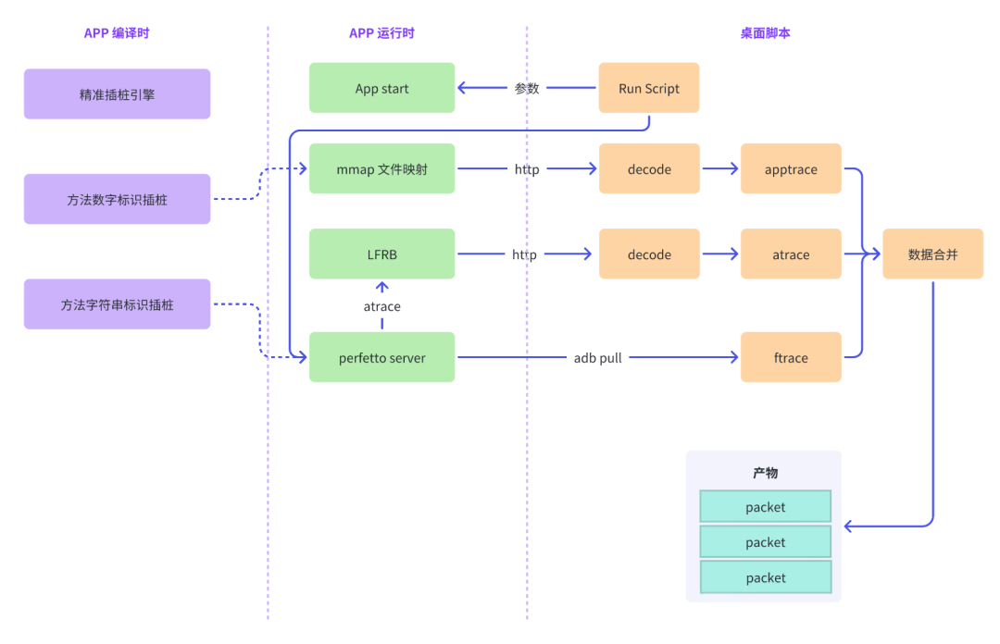

整个流程分为以下三个方向：

1.  **App 编译时：** 在应用程序编译阶段，我们提供了两种插桩模式：方法数字标识插桩和方法字符串标识插桩。方法 数字标识插桩适用于只需要记录方法名称的场景，而方法字符串标识插桩可以同时记录方法参数的值。此外，我们还支持精准插桩引擎，智能识别可疑耗时代码并进行插桩。
1.  **App 运行时：** 在应用程序运行期间，主要工作是采集函数 apptrace 信息，对于方法数字标识类型的信息，通过 mmap 无锁队列方式采集；对于字符串标识类型的信息，直接通过系统函数写入 atrace，同时代理 atrace 写入逻辑，将其替换为 LFRB 高性能写入方案。
1.  **桌面脚本：** 桌面脚本主要用于控制应用程序的运行和开启/关闭 Trace 采集功能。此外，桌面脚本还负责对采集到的 apptrace 与 atrace 数据进行编码，并将它们与 ftrace 进行合并。

## 技术揭秘

### 使用体验

使用体验问题在用户反馈中最多，分析下来基本是存储权限问题、Systrace 环境问题、Python 环境问题、产物体积与打开速度，这些体验问题我们完成了针对性的优化：

#### 1. 权限优化

为进行数据二次处理，桌面脚本需要访问到 App 数据。在 App 层面，最方便的方式是将数据存储到公共 SDCard 中。但从 Android Q 开始，Google 收紧对外置存储完全访问权限。尽管 requestLegacyExternalStorage 可以临时解决这个问题，但从长远来看，SDCard 将无法完全访问。

为解决此问题，我们搭建 Http Server 来通过端口对外访问数据，但访问该 Server 仍需要确定服务地址，为此，我们使用 adb forward 功能，它可以建立一个转发，将 PC 端数据转发到手机端口，并且可以获取从手机端口返回的数据。这样，我们就可以使用 localhost 访问数据。

以上解决了脚本读取 App 数据的问题，我们还面临 App 读取脚本参数问题，比如 maxAppTraceBufferSize、 mainThreadOnly，在 btrace 1.0 支持运行时通过 push 配置文件到指定目录进行动态调整，但这也需要 SDCard 访问权限，为彻底去除权限依赖，我们需要引入新方案。

首先想到的是 adb forward 反向方案：adb reverse，它可以将手机端口数据转发给 PC，实现了从手机到 PC 的访问，同样我们可以在脚本启动 HttpServer 来实现数据接收。但是，因为是网络请求意味着 App 读取参数只能在子线程进行，会有一定的不便，尤其在需要参数实时生效时。

我们又研究了新方案，在桌面脚本通过 adb setprop 给手机设置参数，App 通过 __system_property_get 来读取参数，只要是参数 property 名称以 debug. 开头，就无需任何权限。

```
// 桌面脚本设置参数
Adb.call("shell", "setprop", "debug.rhea.startWhenAppLaunch", "1");

// 手机运行时读取参数
static jboolean JNI_startWhenAppLaunch(JNIEnv *env, jobject thiz) {
    char value[PROP_VALUE_MAX];
    __system_property_get("debug.rhea.startWhenAppLaunch", value);
    return value[0] == '1';
}
```

#### 2. 环境优化

btrace 1.0 基于 Systrace 开发，对 Python 2.7 有强依赖，而 Python 2.7 已被官方废弃，同时大多数 Android 工程师对 Python 不太熟悉，浪费了大量时间解决环境问题。对此，我们计划将 Systrace 切换到 Perfetto ，并选择了 Android 工程师更熟悉的 Java 语言重写了脚本，用户只需有可用的 Java 和 adb 环境，即可轻松使用 btrace 2.0。

#### 3. 产物优化

btrace 1.0 产物是基于 Systrace 的 HTML 文本数据，常常遇到文本内容太大、加载速度过慢、甚至需要单独搭建服务来支持 Trace 显示的问题。Perfetto 是 Google 新推出的性能分析平台，支持多种数据格式解析，Systrace 格式是其中一种，同时 Perfetto 还支持 Protocol Buffer 格式，pb 是一种轻量级、高效的数据序列化格式，用于结构化数据存储和传输。Perfetto 使用 pb 作为其事件记录格式，保证记录系统事件数据的同时，保持数据的高效性和可伸缩性。pb 因为其结构化数据存储可以实现更小体积占用与更快解析速度。因此，btrace 2.0 也将数据格式由 HTML 切换到 pb，在减小产物文件体积的同时，还大幅提升 Trace 在网页上的加载速度。

我们先简单介绍下 Perfetto 的 pb 数据格式，然后再介绍如何将采集到的 apptrace 与 atrace 编码为 pb 格式，以及如何将其与系统 ftrace 进行融合。

Perfetto pb 是由一系列 TracePacket 组成，官方文档可以参考：https://perfetto.dev/docs/reference/trace-packet-proto，这里将介绍 btrace 使用到的一种 TracePacket：FtraceEventBundle：

FtraceEventBundle 是 Android 用于收集系统 Trace 数据的一种机制。它由大量 FtraceEvent 组成，可以被用来记录各种系统行为，如调度、中断、内存管理和文件系统等。btrace 主要利用其中 PrintFtraceEvent 来记录方法 Trace 信息，具体使用方式可以参考下面简单示例：

```
int threadId = 10011;
FtraceEventBundle.Builder bundle = FtraceEventBundle.newBuilder()
        .addEvent(
                FtraceEvent.newBuilder()
                        .setPid(threadId) // 线程内核 pid，就是 tid
                        .setTimestamp(System.nanoTime())
                        .setPrint(
                                Ftrace.PrintFtraceEvent.newBuilder()
                                        // buf 格式是 B|$pid|$msg\n 这里 pid 是实际
                                        // 进程 ID，`\n` 是必须项
                                        .setBuf("B|10010|someEvent\n"))) 
        .addEvent(
                FtraceEvent.newBuilder()
                        .setPid(threadId)
                        .setTimestamp(System.nanoTime() + TimeUnit.SECONDS.toNanos(2))
                        .setPrint(
                                Ftrace.PrintFtraceEvent.newBuilder()
                                        .setBuf("E|10010|\n")))
        .setCpu(0);
Trace trace = Trace.newBuilder()
        .addPacket(
                TracePacketOuterClass.TracePacket.newBuilder()
                        .setFtraceEvents(bundle)).build();
try (FileOutputStream out = new FileOutputStream("demo.pb")) {
    trace.writeTo(out);
}
```

上面示例将得到下面这个 Trace：

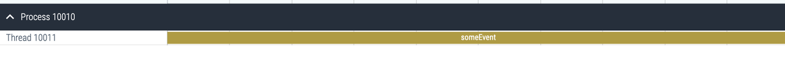

下面再介绍如何将运行时采集到的 apptrace 信息转换成 pb 格式的，这部分操作在桌面脚本进行。

首先脚本通过 adb http 方式获取到手机上 mmap 映射文件，然后再解析文件内容：

```
// 读取 mapping，我们将 mapping 内置到了 apk 的 assets 目录
Map<Integer, String> mapping = Mapping.get();
// 开始解码并保存解码后的结果
List<Frame> result = new ArrayList<>();
byte[] bytes = FileUtils.readFileToByteArray(traceFile);
ByteBuffer buffer = ByteBuffer.wrap(bytes).order(ByteOrder.LITTLE_ENDIAN);
while (buffer.hasRemaining()) {
    long a = buffer.getLong();
    long b = buffer.getLong();
    // 分别解析出 startTime / duration / tid / methodId
    long startTime = a >>> 19;
    long dur0 = a & 0x7FFFF;
    long dur1 = (b >>> 38) & 0x3FFFFFF;
    long dur = (dur0 << 26) + dur1;
    int tid = (int) ((b >>> 23) & 0x7FFF);
    int mid = (int) (b & 0x7FFFFF);
    // 记录相应的开始与结束 Trace
    result.add(new Frame(Frame.B, startTime, dur, pid, tid, mid, mapping));
    result.add(new Frame(Frame.E, startTime, dur, pid, tid, mid, mapping));
}
// 排序
result.sort(Comparator.comparingLong(frame -> frame.time));
```

之后再利用上文介绍的 FtraceEventBundle 对 List<Frame> 进行编码即可，这里不再展开。atrace 的处理方式也是类似的，也不再阐述。

再介绍下如何将采集到的 apptrace、atrace 与系统 ftrace 进行合并。

前文介绍过，Perfetto pb 是由一系列 TracePacket 组成，一般而言，我们只要将业务采集到的 Trace 分别封装成 TracePacket，然后加入到系统 TracePacket 集合中就完成了 Trace 的合并。

```
Trace.Builder systemTrace = Trace.parseFrom(systraceStream).toBuilder();
FtraceEventBundle.Builder bundle = ...;
for (int i = 0; i < events.size(); i++) {
    bundle.addEvent(events.get(i).toEvent());
}
systemTrace.addPacket(TracePacket.newBuilder().setFtraceEvents(bundle).build());
```

然而，这里有一个前提，就是业务采集的 apptrace / atrace 时间戳与系统 frace 时间戳一致。实际上，根据实际测试的结果，不同设备 ftrace 时间戳可能会采用不同时间，可能是 BOOTTIME，也可能是 MONOTONIC TIME。这导致业务层无论使用哪种时间戳都只能兼容部分设备。为解决此问题，我们在开始记录 trace 信息时，先记录一份 BOOTTIME 和 MONOTONIC TIME 初始时间，之后再记录时间戳时，都统一使用 MONOTONIC 时间。

最后在脚本中解析 ftrace 时间戳进行判断，如果与 MONOTONIC 接近，就采用 MONOTONIC；如果与 BOOTTIME 接近，就采用 BOOTTIME。虽然我们没有单独记录每个函数的 BOOTTIME，但是可以通过 MONOTONIC 与初始时间差异折算。

```
if (Math.abs(systemFtraceTime - monotonicTime) < Math.abs(systemFtraceTime - bootTime)) {
    Log.d("System is monotonic time.");
} else {
    long diff = bootTime - monotonicTime;
    Log.d("System is BootTime. time diff is " + diff);
    for (Event e: events) {
        e.time += diff;
    }
}
```

### 性能体验

#### 1. 运行时优化

btrace 1.0 在插桩上是严格依赖 Systrace 模式，通过在方法开始与结束插入 Trace.beginSection 与 endSection。但是 beginSection 参数是字符串，百万级别方法插桩会造成数百万字符串额外内存占用，对内存造成巨大压力，并且也导致数据 IO 持久化压力巨大。此外，字符串数据大小不可预测，只能通过有锁或者 LFRB 方式来记录数据，无法做到数据高效并发写入，只能将数据缓存在 buffer 中，但是过小 buffer 容易导致数据丢失，过大则会造成内存浪费。

btrace 2.0 版本通过将方法 ID 数字化，将方法执行信息记录到一个 mmap 映射文件中。由于方法 ID 大小是已知的，可以使用 atomic 原子操作计算存储数据位置，从而实现无锁并发写入，同时方法数字存储占用内存更小，IO 持久化压力也更小。

同时，我们发现 Trace.beginSection 和 endSection 方式，需要记录每个方法的开始与结束时间、线程 ID 与方法 ID，这里面的线程 ID 和方法 ID 会重复记录，也导致了内存浪费。于是专门进行了优化，在一条记录中同时记录开始时间、方法耗时、线程 ID 和方法 ID 信息，合计占用 2 个 long，可以充分利用内存。

具体插桩逻辑可以参考伪代码：

```
// 业务代码
public void appLogic() {
    long begin = nativeTraceBegin();
    // 业务逻辑
    nativeTraceEnd(begin, 10010);
}

// 插桩逻辑
long nativeTraceBegin() {
    return nanoTime();
}

void nativeTraceEnd(long begin, int mid) {
    long dur = nanoTime() - begin;
    int tid = gettid();
    write(begin, dur, tid, mid);
}
```

方法耗时数据记录格式示例：

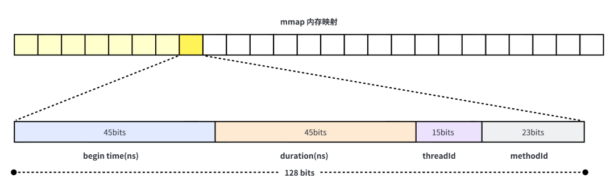

方法插桩在 Java 层，但是数据采集基于 mmap 方式在 native 层实现。这会导致高频 JNI 调用，当一个非 JNI 方法调用常规 JNI 方法，以及从常规 JNI 方法返回时，需要做线程状态切换，线程状态切换就会涉及到 GC 锁操作，会有较大性能开销。

熟悉 Android 系统的同学可能了解系统专门为高频 JNI 调用做的性能优化，通过 @CriticalNative 注解与 @FastNative 注解方式来实现，@FastNative 可以使原生方法的性能提升高达 2 倍，@CriticalNative 则可以提升高达4倍。

我们也参考系统的方式，给方法添加 @CriticalNative 注解实现方法调用加速。但是 @CriticalNative 注解是隐藏 API无法直接使用，可以通过构建一个定义 CriticalNative 注解的 jar 包，在项目中通过 compileOnly 方式依赖，来达到使用 @CriticalNative 注解的目的。相关注解定义参考自源码：

```
// ref: https://cs.android.com/android/platform/superproject/+/master:libcore/dalvik/src/main/java/dalvik/annotation/optimization/CriticalNative.java;l=26?q=criticalnative&sq=
@Retention(RetentionPolicy.CLASS)  // Save memory, don't instantiate as an object at runtime.
@Target(ElementType.METHOD)
public @interface CriticalNative {}
```

具体使用规则可以参考下面代码：

```
// Java 方法定义，必须是 static，不能用 synchronized，参数类型必须是基本类型
@CriticalNative
public static long nativeTraceBegin();

// Critical JNI 方法，不再需要声明 JNIEnv 与 jclass 参数
static jlong Binary_nativeTraceBegin() {
    ...
}

// 动态绑定
JNINativeMethod t = {"nativeTraceBegin", "(I)J",  (void *) JNI_CriticalTraceBegin};
env->RegisterNatives(clazz, &t, 1);
```

@CriticalNative/@FastNative 是 8.0 及以后才支持的特性，对于 8.0 以前的设备，也可以通过在方法签名中加入`!`方式来开启 FastNative：

```
// Fast JNI 方法，和普通 JNI 方法一样需要 JNIEnv 参数与 jclass 参数
static jlong Binary_nativeTraceBegin(JNIEnv *, jclass) {
    ...
}

// 动态绑定
JNINativeMethod t = {"nativeTraceBegin", "!(I)J",  (void *) Binary_nativeTraceBegin};
env->RegisterNatives(clazz, &t, 1);
```

以上方法 ID 数字化采集优化的相关内容，前文产物优化专题已经介绍具体的数据解码和 mapping 映射的方案，这里不再赘述。

虽然方法数字 ID 采集具有性能与内存的优势，但它也有一些限制，因为它只能记录在编译阶段准备的通过 ID 映射的内容，无法记录 App 运行时动态生成的内容。因此，除了方法 ID 的存储外，我们还支持字符串类型的数据存储，主要用于记录 btrace 细粒度监控数据和方法参数值。这一方案与 btrace 1.0 中的 LFRB 方案相似，这里就不再详细阐述。由于大部分 trace 数据都是方法 ID，已经被 mmap 分担了压力，因此 LFRB 的压力相比 btrace 1.0 小得多，我们可以适当减小 buffer 大小。

#### 2. 精准插桩

另一个性能优化是插桩优化。随着应用中方法数量越来越多，插桩方法数量也随之增多，久而久之插桩对应用性能损耗也会越大。btrace 1.0 通过提供 traceFilterFilePath 配置让用户来选择对哪些方法插桩，哪些不插桩，灵活配置的同时也把最终性能与插桩权衡的困扰转移给了用户。

在 2.0 中，我们希望建立一套智能规则，可以精准识别用户关心的高耗时方法，同时将不耗时方法精准的排除在插桩规则以外，可以实现智能精准插桩体验。

Android App 项目源码最终会编译为字节码，虽然 Android 虚拟机支持 200 多条字节码指令，但可能导致性能瓶颈的指令往往是比较少且易于枚举的，如 IO 读取、synchronized 字节码、反射、Gson 解析等函数调用等。我们在编译过程中将调用相关指令的方法视为疑似耗时方法，而剩余的非耗时函数则不进行插桩，因为它们不会导致性能问题，从而大大缩小了插桩范围。

| 耗时特征      | 指令名                                                                         | 说明                                                                                                               |
| --------- | --------------------------------------------------------------------------- | ---------------------------------------------------------------------------------------------------------------- |
| 锁         | monitorenter & monitorexit ；ACC_SYNCHRONIZED                                | Java 锁关键字                                                                                                        |
| Native 方法 | ACC_NATIVE                                                                  | 因为 Native 方法通过字节码层面无法继续分析，因此我们认为 Native 都存在耗时可能；                                                                 |
| 循环        | goto                                                                        | 循环关键字，依据实际情况决定是否加入“疑似耗时操作”名单                                                                                     |
| 特殊方法调用    | InvokeVirtual； InvokeSpecial； InvokeStatic； InvokeInterface； InvokeDynamic； | 这里我们将特殊方法调用做归类，大分部来自 Android SDK 中； 1、IO 相关，文件操作、so 加载、dex 加载、字体加载等； 2、UI 相关，View 的布局、绘制等，动画相关； 3、IPC 相关，IPC 接口； |
| 大方法       | InvokeVirtual； InvokeSpecial； InvokeStatic； InvokeInterface； InvokeDynamic； | 当一个方法中直接或间接调用的 invoke 字节码指令数超过阈值，可以认为该方法是一个CPU密集型操作方法，具有耗时可能性                                                    |

以上述耗时特征为基础，我们设计了一条精细化插桩方案，方便用户可以根据具体的情况选择需要的插桩方法。支持的配置方案如下所示：

```
# 对锁相关的方法插桩
-tracesynchronize

# 对Native方法的调用点插桩
-tracenative

# 对Aidl方法插桩
-traceaidl

# 对包含循环的方法插桩
-traceloop

# 关闭默认耗时方法的调用插桩
-disabledefaultpreciseinstrumentation

# 开启大方法插桩，方法效用数超过40
-tracelargemethod 40

# 该方法的调用方需要进行插桩
-traceclassmethods rhea.sample.android.app.PreciseInstrumentationTest {
   test
}

# 被该注解修饰的方法需要被插桩
-tracemethodannotation org.greenrobot.eventbus.Subscribe

# 该Class的所有方法均会被插桩
-traceclass io.reactivex.internal.observers.LambdaObserver

# 该方法的参数信息会在Trace中保留
-allowclassmethodswithparametervalues rhea.sample.android.app.RheaApplication {
   printApplicationName(*java.lang.String);
}
```

经过我们的精细化插桩后，抖音的插桩数量减少了 94%，在保留较完整的 Trace 数据的同时，性能有了显著的提升。

总之，我们通过权衡耗时函数插桩的优点和缺点，这样可以帮助我们尽可能的获取到足够的耗时函数信息，同时避免过度插桩导致不必要的性能损耗。

### 监控数据

监控数据是 Trace 的核心，关系到 Trace 能否给用户带来实际价值，除了常规方法执行 Trace 以外，本次 2.0 还带来了渲染监控、Binder 监控、阻塞监控、线程创建监控等四大能力，下面将介绍相关背景与实现原理。

#### 1. 渲染监控

Android 系统提供提供 RenderThread 关键执行逻辑的跟踪埋点，但其提供的信息不够充分，无法直观分析是具体影响渲染问题的业务代码，下图是 atrace 中渲染线程 Trace 示例：

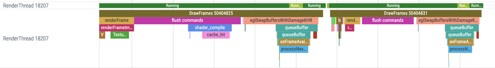

为此，我们针对这部分信息进行更精细化拓展展示，新增记录渲染关键 View 节点，下图是优化后效果：

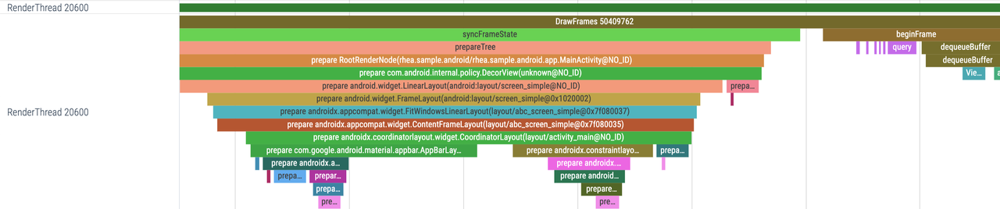

渲染监控核心原理如下图：

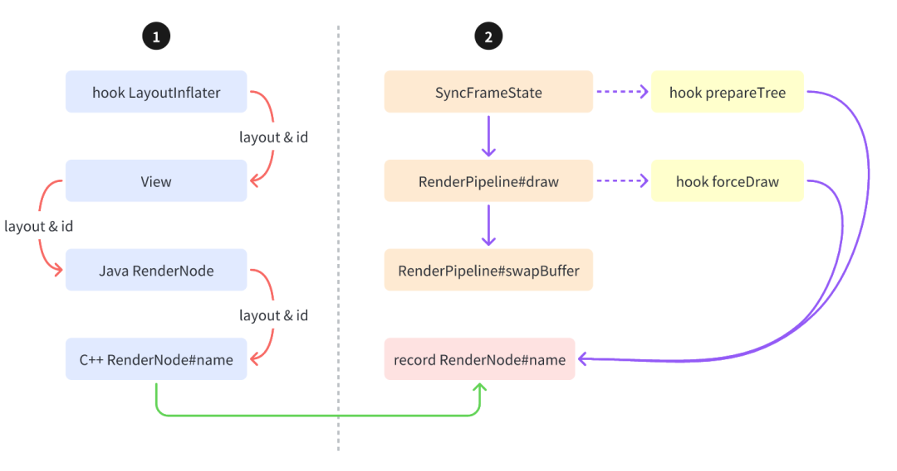

1. 代理 LayoutInflater 获取到 inflate 时 View 所属的布局信息，再通过 View 的 RenderNode 与 native 层 RenderNode关系，将 View 所属布局信息绑定到 RenderNode 的 name 字段上。
2. Hook 渲染阶段的关键节点，比如 SyncFrameState 阶段的 RenderNode::prepareTreeImpl  方法和 RenderPipeline 阶段的 RenderNodeDrawable::forceDraw 方法，将 RenderNode 所属 View 的布局信息记录到 Trace 中。

#### 2. Binder 监控

原始 atrace 中 Binder 信息只有 binder transaction 信息，缺少具体 binder 接口与方法名称，对问题排查帮助有限。比如下图中我们无法得知具体是什么 Binder 调用。


btrace 的 Binder 增强目标是将 Binder 调用的接口名称与方法名称进行解析与展示，实现效果如下：

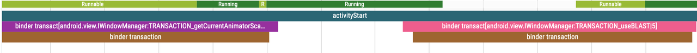

核心原理通过 plt hook `IPCThreadState::transact` 记录 binder 调用的 code 与 Parcel& data 参数中的 interfaceName.

```
status_t IPCThreadState::transact(int32_t handle, uint32_t code, const Parcel& data,
                                  Parcel* reply, uint32_t flags);
```

但是 Parcel 结构是非公开，很难从 data 中解析出 interfaceName 信息，于是转变思路，通过 hook `Parcel::writeInterfaceToken` 来记录 interfaceName 与 Parcel 关联信息，随后再在 `IPCThreadState::transact` 中通过查询获取 interfaceName.

```
status_t Parcel::writeInterfaceToken(const char* interface) {
    // 记录 this Parcel 与 interface 名称的关联
}

status_t IPCThreadState::transact(int32_t handle, uint32_t code, const Parcel& data,
                                  Parcel* reply, uint32_t flags) {
    // 查询 Parcel data 对应的 interface
    // 记录 Trace
    RHEA_ATRACE("binder transact[%s:%d]", name.c_str(), code);
}
```

这就记录了以下信息，包含了 interfaceName 与 code：

```
binder transact[android.content.pm.IPackageManager:5]
```

此外，还需要将 code 解析到对应 Binder 调用方法。在 AIDL 中，interfaceName$Stub 类静态字段中记录了每个 code 与对应 Binder 调用名称。可以在抓取 trace 结束时，通过反射获取 code 与名称映射关系，将他保存到 Trace 产物中。

```
#android.os.IHintManager
TRANSACTION_createHintSession:1
TRANSACTION_getHintSessionPreferredRate:2
#miui.security.ISecurityManager
TRANSACTION_activityResume:27
TRANSACTION_addAccessControlPass:6
```

最后通过桌面脚本进行处理，将运行时记录的 Trace 中 code 进行替换，替换为真实的方法名称即可。

#### 3. 阻塞监控

在系统 atrace 中提供了系统锁冲突 Trace 信息，比如通过下图可以得知主线程 Keva 在获取锁时与 16105 线程发生锁冲突，这给优化线程阻塞提供了重要的信息输入。

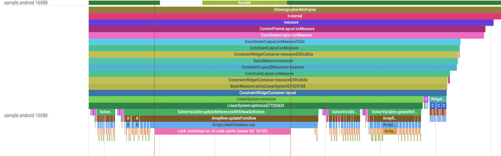

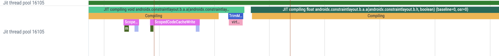

但是线程阻塞原因不只有锁冲突，还包含 wait/park 等原因导致的线程等待，btrace 阻塞监控就是提供这部分阻塞信息，下面是 wait/notify 关联示例，通过检索锁 obj 信息可以得知当前线程 wait 匹配的 notify 的位置：

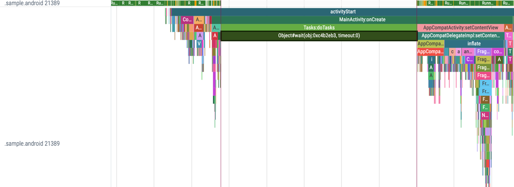

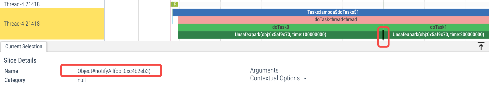

wait与 park 等待原理类似，这里以大家更熟悉的 wait/notify 组合进行说明。

wait/notify 都是 Object 直接定义的方法，本质上都是 JNI 方法，可以通过 JNI hook 方式记录他们的调用。

```
public final native void wait(long timeoutMillis, int nanos) throws InterruptedException;
public final native void notify();
```

在对应的 hook 方法中，通过 Trace 记录他们的执行与对应的 this（也就是锁对象）的 identityHashCode，这样可以通过 identityHashCode 建立起映射关系。

```
static void Object_waitJI(JNIEnv *env, jobject java_this, jlong ms, jint ns) {
    ATRACE_FORMAT("Object#wait(obj:0x%x, timeout:%d)", Object_identityHashCodeNative(env, nullptr, java_this), ms);
    Origin_waitJI(env, java_this, ms, ns);
}

static void Object_notify(JNIEnv *env, jobject java_this) {
    ATRACE_FORMAT("Object#notify(obj:0x%x)", Object_identityHashCodeNative(env, nullptr, java_this));
    Origin_notify(env, java_this);
}
```

#### 4. 线程创建监控

在分析 Trace 时可能会遇到一些异常的线程，这时候往往需要分析线程在什么地方被创建，但是在传统 Trace 中缺少这部分信息。

于是 btrace 加入了线程创建监控数据，核心原理是对 pthread_create 进行代理，记录线程创建的同时，还记录被创建线程的 tid。但是在 pthread_create 调用完成时是无法得知被创建线程 ID 的，通过分析系统源码，发现 pthread_t 本质上是一个 pthread_internal_t 指针，而 pthread_internal_t 则记录着被创建线程的 ID.

```
// https://cs.android.com/android/platform/superproject/+/master:bionic/libc/bionic/pthread_internal.h
struct pthread_internal_t {
    struct pthread_internal_t *next;
    struct pthread_internal_t *prev;
    pid_t tid;
};

int pthread_create_proxy(pthread_t *thread, const pthread_attr_t *attr,
                         void *(*start_routine)(void *), void *arg) {
    BYTEHOOK_STACK_SCOPE();
    int ret = BYTEHOOK_CALL_PREV(pthread_create_proxy,
                                 thread, attr, start_routine, arg);
    if (ret == 0) {
        ATRACE_FORMAT("pthread_create tid=%lu", ((pthread_internal_t *) *thread)->tid);
    }
    return ret;
}
```

最终实现效果如图，比如发现 Thread 16125 是新创建的线程，需要分析其创建位置，替换为线程池实现。

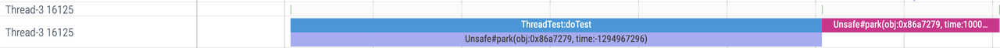

只需要检索 `pthread_create tid=16125`就能找到对应的创建堆栈。


# 总结展望

以上介绍了 btrace 2.0 的主要优化点，更多优化还需要在日常使用中去体会。2.0 不是终点，是新征程的起点，我们还将围绕下面几点持续优化，将 btrace 优化到极致：

1.  使用体验：深入优化使用体验，比如支持不定长时间 Trace 采集，优化采集耗时。
1.  性能体验：持续探索性能优化，正面与侧面优化双结合，提供更加极致性能体验。
1.  监控数据：在 Java 与 ART 虚拟机基础之上，建设包括内存、C/C++、JavaScript 等更多更全的监控能力。
1.  使用场景：提供线上场景接入与使用方案，帮助解决线上疑难问题。
1.  生态建设：围绕 btrace 2.0 建设完善生态，通过性能诊断与性能防劣化，自动发现存量与增量性能问题。

最后，欢迎大家深入讨论与交流，一起协作构建极致 btrace 工具！

