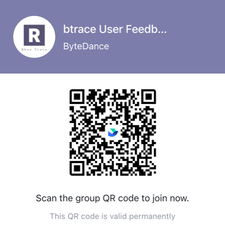

# btrace


[README 中文版](./README.zh-CN.md)

[btrace for Android](#btrace-for-android)

[btrace for iOS](#btrace-for-ios)


## Major Update

We are proud to announce the launch of btrace 3.0, introducing an industry-first high-performance synchronized sampling-based tracing solution. Additionally, the new version now provides comprehensive iOS tracing capabilities.

## btrace for Android

### Integration

Add dependencies in app/build.gradle file:

``` groovy
dependencies {
    if (enable_btrace == 'true') {
        implementation 'com.bytedance.btrace:rhea-inhouse:3.0.0'
    } else {
        implementation 'com.bytedance.btrace:rhea-inhouse-noop:3.0.0'
    }
}
```

Add `enable_btrace` switch in the gradle.properties file:

```
# Turn on this switch when you want to build app that support tracing.
enable_btrace=false
```

Add initialization code in `attachBaseContext()` method of your Application:

``` java

public class MyApp extends Application {

    @Override
    protected void attachBaseContext(Context base) {
        super.attachBaseContext(base);
        // When rhea-inhouse-noop is used, RheaTrace3.init() has empty implementation.
        RheaTrace3.init(base);
    }
}

```

### Usage

To use btrace 3.0, follow these instructions:

1. Make sure that your computer has integrated adb and Java and Python3 environment.
2. Connect your phone to your computer and make sure it can recognized by adb devices.
3. Install the APK that integrates btrace 3.0 on your phone.
4. Download the latest script from "Script Management" below to your computer.
5. In the directory where the computer script is located, execute the following command:

```shell
java -jar rhea-trace-shell.jar -a ${your_package_name} -t 10 -o output.pb -r sched
```

6. Open the generated trace file in https://ui.perfetto.dev/ for detailed analysis.

#### Script Management
| Version | Release Date       | jar                             | Release Notes |
| ---|------------|--------------------------------| ---|
| 3.0.0 | 2025-06-10 | [rhea-trace-shell-3.0.0.jar](https://oss.sonatype.org/service/local/repositories/releases/content/com/bytedance/btrace/rhea-trace-processor/3.0.0/rhea-trace-processor-3.0.0.jar) | 3.0 first release | 

#### Parameters Description


##### Required Parameters

| Parameter | Default Value | Description |
|---|---|---|
| -a $applicationName|N/A|Specifies the package name of your app|

##### Optional Parameters

| Parameter | Default Value | Description |
|---|---|---|
| -o $outputPath | ${applicationName}_yyyy_MM_dd_HH_mm_ss.pb | Specifies the path where the trace artifact is saved. By default, the value is autogenerated based on the tracing app package name and current timestamp. |
| -t $timeInSecond | 5 | Specifies the duration of the tracing, in seconds.<br>Note that: On MacOS, interactive tracing mode will be activated if you don't specifying the tracing duration. On windows, tracing dration must be specified, because we don't support interactive tracing mode on Windows currently. |
| -m $mappingPath | | Specifies the mapping file path for the abofuscated app.<br>Note that: it's not the methodMapping file that was used in btrace 2.0, but the mapping file generated by proguard. There is no methodMapping file in btrace 3.0. |
| -mode $mode | Decided at runtime. | btrace currently support two kinds of modes: <ol><li>perfetto: The default mode for systems 8.1 and above, allowing collecting  system atrace and ftrace using perfetto service besides the app trace.</li> <li>simple: The default mode for systems below 8.1, allowin collecting app trace only.</li></ol> |
|-maxAppTraceBufferSize $size | 200000 | Specifies the maximum  count of stacktraces that our buffer allows to save, previously saved stacktraces will be overwritten if the maximum limit is met. |
| -sampleInterval $ns | 1000000 | Specifies the minimum sampling backtracing interval in nanoseconds. |
| -waitTraceTimeout | 20 | Specifies the timeout seconds for waiting for tracing data writing to complete and being pulled to the PC. |
| -s $serial | | Specifies the device connected by adb. |
| -r |  | Automatically restarts the app to tracing the start up stage. |
| --list || Displays a list of supported atrace categories for the device. |


### Known Issues

| | Problems | Advices | 
| -- | --- | --- | 
| 1 | We currently only support devices running Android 8.0 or higher. | Please use devices with Android 8.0 or higher. |
| 2 | Java object allocation monitoring is not yet adapted for devices with Android 15 and above. | If you need to inspect object memory allocation information or require more detailed tracing, please use devices with Android versions below 15. |
| 3 | Devices that do not support Perfetto (mostly systems before 8.1) cannot collect system information such as CPU scheduling. | Try with -mode simple. |
| 4 | 32-bit devices or applications cannot collect tracing data. | Please install and use 64-bit applications on 64-bit devices. | 

## btrace for iOS

Record trace data offline without Instruments to help find performance issue of your app.

### Installation

Clone source code, and add the following lines to your Podfile:

```ruby
pod 'BTrace', :path => 'xxx/btrace-iOS'
pod 'BTraceDebug', :path => 'xxx/btrace-iOS'
pod 'fishhook', :git => 'https://github.com/facebook/fishhook.git', :branch => 'main'
```

Install command line tool:

```bash
# using homebrew
brew install libusbmuxd
brew install poetry

# install from the BTraceTool directory
poetry install
```

### Usage

Activate the virtual environment before executing commands.
```bash
# activate from the BTraceTool directory
poetry shell
# or 
poetry env activate
```

#### Record

Note that if '-l' is not specified, app must have been launched before recording.

```bash
python3 -m btrace record [-h] [-i DEVICE_ID] [-b BUNDLE_ID] [-o OUTPUT] [-t TIME_LIMIT] [-d DSYM_PATH] [-m] [-l] [-s]
```
##### Options
| Option | Description          |
|---------------------------------------| -----------  |
| -h, --help                | Show help      |
| -i DEVICE_ID, --device_id DEVICE_ID |  Device id. If not specified: <br>· If only one device is connected to Mac, it will be chosen <br>· If multiple devices are connected to Mac, prompt the user to make a selection |
| -b BUNDLE_ID    --bundle_id BUNDLE_ID |  Bundle id |
| -o OUTPUT       --output OUTPUT | Output path. If not specified, data will be saved to '~/Desktop/btrace'|
| -t TIME_LIMIT   --time_limit TIME_LIMIT | Limit recording time, default 3600s |
| -d DSYM_PATH    --dsym_path DSYM_PATH |  Dsym file path, or app path built by Xcode in debug mode. If specified，flamegraph will be displayed automatically after the recording ends |
| -m    --main_thread_only |  If given, only record main thread trace data |
| -l    --launch  |  If given, app will be launched/relaunched, and start recording on app launch|
| -s    --sys_symbol  |  If given, symbols in the system libraries will be parsed |
##### Examples
```bash
python3 -m btrace record -i xxx -b xxx -d /xxxDebug-iphoneos/xxx.app
python3 -m btrace record -i xxx -b xxx -d /xxxDebug-iphoneos/xxx.dSYM
```

#### Stop
```bash
ctrl + c
```

#### Parse

When should the 'parse' command used?
- '-d' option is not specified in the 'record' command.
- reopen the parsed data

```bash
python3 -m btrace parse [-h] [-d DSYM_PATH] [-f] [-s] file_path
```
##### Options
| Option                       | Description          |
|---------------------------------------| -----------  |
| -h, --help                | Show help      |
| -d DSYM_PATH, --dsym_path DSYM_PATH |  Dsym file path, or app path built by Xcode in debug mode |
| -s, --sys_symbol  |  If given, symbols in the system libraries will be parsed |
| -f, --force  |  If given, force re-parsing trace data |
##### Examples
```bash
btrace parse -d /xxx.dSYM xxx.sqlite
btrace parse -d /xxx.app xxx.sqlite
```

## Technology Principle
If you are interested in the internal details of btrace 3.0, you can refer to the document: [btrace 3.0 Internal Principle in Detail!](INTRODUCTION.MD) . 

## Feedback
We've made a lot of improvements in btrace 3.0, including better error prompts. There might still be some cases where the prompts aren't accurate enough or the messages aren't clear. If you run into any issues, just give us a shout in the Lark group below, and we'll do our best to help you out. We always appreciate any other feedback or suggestions you might have too, thanks you!



## Contributes

[Contributing Guide](./CONTRIBUTING.MD)

## License

[Apache License](./LICENSE)